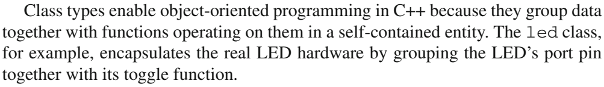
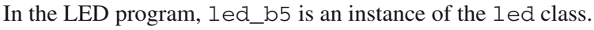

# C++ type sizes and object-oriented basics

[25-page companion PDF](../../../Projects/CppOOP/cpp-oop-notes.pdf) | [Editable lesson](companion.md) | [20 runnable topics](../../../Projects/CppOOP/code/README.md) | [Bookshelf](../../README.md)

The lesson uses your Teacher, student, person, gradStudent, print, parent/child, and shape examples. Each topic starts with a concise interview definition, then explains the mechanism with focused snippets, measured outputs, and exact book-page references. The live practice.cpp can change as you practice; the document points to stable topic programs.

| Topic | PDF page | Lesson section |
| --- | ---: | --- |
| Storage size: bytes and bits | 1 | [Read the section](companion.md#storage-size-bytes-and-bits) |
| Integer types and their sizes | 2 | [Read the section](companion.md#integer-types-and-their-sizes) |
| bool, characters, and floating point | 3 | [Read the section](companion.md#bool-characters-and-floating-point) |
| sizeof objects, pointers, and arrays | 4 | [Read the section](companion.md#sizeof-objects-pointers-and-arrays) |
| Classes, objects, state, and behavior | 5 | [Read the section](companion.md#classes-objects-state-and-behavior) |
| Encapsulation | 6 | [Read the section](companion.md#encapsulation) |
| Default and parameterized constructors | 7 | [Read the section](companion.md#default-and-parameterized-constructors) |
| this and the copy constructor | 8 | [Read the section](companion.md#this-and-the-copy-constructor) |
| Shallow copy | 9 | [Read the section](companion.md#shallow-copy) |
| Deep copy | 10 | [Read the section](companion.md#deep-copy) |
| Destructors and safe ownership | 11 | [Read the section](companion.md#destructors-and-safe-ownership) |
| Inheritance | 12 | [Read the section](companion.md#inheritance) |
| Function overloading | 13 | [Read the section](companion.md#function-overloading) |
| Constructor overloading | 14 | [Read the section](companion.md#constructor-overloading) |
| Operator overloading | 15 | [Read the section](companion.md#operator-overloading) |
| Function overriding | 16 | [Read the section](companion.md#function-overriding) |
| Virtual functions and runtime polymorphism | 17 | [Read the section](companion.md#virtual-functions-and-runtime-polymorphism) |
| Abstraction and abstract classes | 18 | [Read the section](companion.md#abstraction-and-abstract-classes) |
| Local static variables | 19 | [Read the section](companion.md#local-static-variables) |
| Static data members and member functions | 20 | [Read the section](companion.md#static-data-members-and-member-functions) |
| Friend functions | 21 | [Read the section](companion.md#friend-functions) |
| Friend classes | 22 | [Read the section](companion.md#friend-classes) |
| Object lifetime and storage duration | 23 | [Read the section](companion.md#object-lifetime-and-storage-duration) |
| Reading map | 24 | [Read the section](companion.md#reading-map) |
| Running and revising the examples | 25 | [Read the section](companion.md#running-and-revising-the-examples) |

## Original source pages

- [Overloading, virtual interfaces, static, friendship, and lifetime](../polymorphism-and-lifetime/README.md) displays the selected actual source pages beside their explanations.

- [Type sizes](../type-sizes/README.md) displays The C++ Programming Language, 4th edition, section 6.2.8, PDF pages 229-230, alongside the size, width, and limits explanation.
- [Encapsulation](../encapsulation/README.md) displays A Tour of C++, 3rd edition, section 2.3, PDF page 48.
- [Constructors, copying, lifetime, inheritance, and overloading](../constructors-copying-and-lifetime/README.md) displays the selected actual Tour source pages beside their explanations.

### Class definition

**Interview definition (summary):** A class is a user-defined type that groups data members and member functions to define its objects' state and behavior.

**Real-Time C++, 2nd edition - Christopher Kormanyos.** Section 1.3 Class Types; [PDF page 30](../../Real-Time%20C%2B%2B%20-%202nd%20Edition.pdf#page=30), verified printed page 6.

The passage groups data with the functions that operate on it. In Teacher, salary is a data member, and the setter and getter are operations on it. Stroustrup's broader class/concept explanation is displayed in the companion's class section.

### Object and instance

**Interview definition (summary):** A class object is a particular instance of its class with its own non-static member values and a lifetime.

**Real-Time C++, 2nd edition - Christopher Kormanyos.** Section 1.5 Objects and Instances; [PDF page 35](../../Real-Time%20C%2B%2B%20-%202nd%20Edition.pdf#page=35), verified printed page 11.

The source distinguishes the led class from its led_b5 instance. The same relationship is Teacher and t1 in your example. For the broader C++ object concept, including int objects, see Stroustrup's [section 6.4, PDF page 251](../../The%20C%2B%2B%20Programming%20Language%20-%204th%20Edition.pdf#page=251).

## Rebuild the companion

The [builder](build_companion.py) reads [companion.md](companion.md), validates document measurements against tmp/cpp-topic-builds/verification.json, produces a PDF review candidate, and renders every page under tmp/pdfs/cpp-companion. Refresh the topic outputs with [verify.ps1](../../../Projects/CppOOP/code/verify.ps1) when their sources change. Run the PDF skill's artifact-operation marker once before an authoring session; inspect the rendered output before replacing the delivered cpp-oop-notes.pdf.
