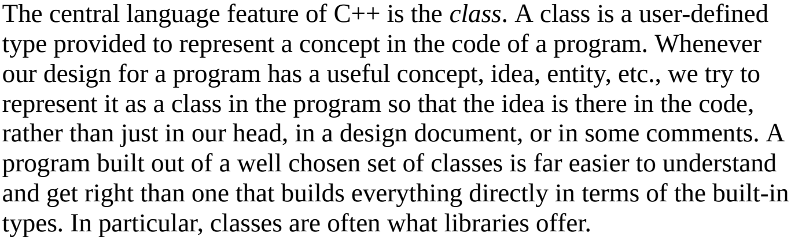
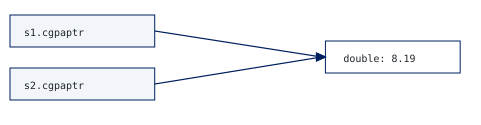
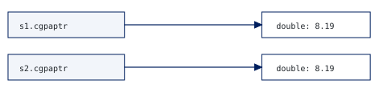

# C++ type sizes and object-oriented basics

Your C++ examples, from type sizes and objects to polymorphism, static, and friendship.

<!-- contents -->

## Storage size: bytes and bits

**Interview definition (summary):** The size of a type is the storage occupied by an object of that type, measured in C++ bytes with `sizeof`.

A type determines how a stored value is interpreted and which operations are available. Size tells you how much storage its object occupies. An `int` object holding 1 and an `int` object holding 1000 occupy the same number of bytes on a given implementation. A larger value does not make an existing object grow.

A bit has two possible states. A C++ byte is the smallest addressable unit of storage; `CHAR_BIT`, from `<climits>`, reports its number of bits. C++ requires at least 8 bits per byte. On the compiler used for these examples, a byte has 8 bits and `double` occupies 8 bytes, so its object representation occupies 64 bits.

```cpp
std::cout << CHAR_BIT << '\n';       // measured here: 8 bits per byte
std::cout << sizeof(double) << '\n'; // measured here: 8 bytes
```

`sizeof(char)` is always 1 C++ byte. Other exact fundamental-type sizes depend on the implementation. Think of a type as having a fixed size for the chosen compiler and target; another compiler or target can choose a different size.

**Source:** Stroustrup, [A Tour of C++, 3rd edition, section 1.4, PDF page 25](../../A%20Tour%20of%20C%2B%2B%20-%203rd%20Edition.pdf#page=25). The byte and `sizeof` rules are also specified in [the working draft, sizeof](https://eel.is/c++draft/expr.sizeof).

<!-- page -->

## Integer types and their sizes

**Interview definition (summary):** An integer type represents whole numbers; its width determines its value range, while `sizeof` measures its storage in bytes.

The table separates a language guarantee from measurements made with Microsoft C++ 19.42, x64, in C++20 mode. Minimum widths include the sign bit for signed types. They are expressed in bits, independently of how many bits the target uses for one byte.

| Signed type | Minimum width | Measured bytes | Measured bits |
| --- | --- | --- | --- |
| `signed char` | 8 bits | 1 | 8 |
| `short int` | 16 bits | 2 | 16 |
| `int` | 16 bits | 4 | 32 |
| `long int` | 32 bits | 4 | 32 |
| `long long int` | 64 bits | 8 | 64 |

`short` means `short int`; `long` means `long int`; `long long` means `long long int`. `signed` alone means `signed int`, and `unsigned` alone means `unsigned int`. These are alternate spellings, not additional storage-size choices.

The integer storage order permits equality:

```cpp
sizeof(char) <= sizeof(short) && sizeof(short) <= sizeof(int);
sizeof(int) <= sizeof(long) && sizeof(long) <= sizeof(long long);
```

Here `long` and `int` both occupy 4 bytes. A 64-bit target does not make every integer type 8 bytes. Other implementations can make `long` 8 bytes. Measure rather than guessing from the operating system's name.

Each unsigned integer counterpart occupies the same storage as its signed counterpart, but represents nonnegative values. On this compiler, `int` ranges from -2,147,483,648 to 2,147,483,647; `unsigned int` ranges from 0 to 4,294,967,295. For an integer width $N$, the signed range is from $-2^{N-1}$ to $2^{N-1}-1$, and the unsigned range is from 0 to $2^N-1$. Storage can also include padding bits, so query actual limits with `<limits>`.

```cpp
std::cout << std::numeric_limits<int>::lowest() << '\n';
std::cout << std::numeric_limits<int>::max() << '\n';
```

**Sources:** Stroustrup, [The C++ Programming Language, 4th edition, section 6.2.8 Sizes, PDF pages 228-230](../../The%20C%2B%2B%20Programming%20Language%20-%204th%20Edition.pdf#page=229); [working draft, fundamental types](https://eel.is/c++draft/basic.fundamental), minimum-width table. Local results come from the runnable type-size example.

<!-- page -->

## bool, characters, and floating point

**Interview definition (summary):** `bool` represents true or false, character types represent character code units, and floating-point types represent numbers with a finite range and precision.

| Type | Measured bytes | Meaning or distinction |
| --- | --- | --- |
| `bool` | 1 | Two values; its storage need not be one bit. |
| `char` | 1 | Always one C++ byte. |
| `signed char`, `unsigned char` | 1 each | Same storage; different value ranges. |
| `float` | 4 | 6 guaranteed significant decimal digits here. |
| `double` | 8 | 15 guaranteed significant decimal digits here. |
| `long double` | 8 | 15 guaranteed significant decimal digits here. |
| `wchar_t` | 2 | Size depends on the implementation. |
| `char8_t`, `char16_t`, `char32_t` | 1, 2, 4 here | Distinct UTF code-unit types, not one whole character each. |

These are measured storage sizes, not universal byte counts. `char`, `signed char`, and `unsigned char` are distinct types. Plain `char` has an implementation-defined signedness; the default compiler configuration used here makes it signed. A user-visible Unicode character may require several code units.

**Range and precision answer different questions.** Range describes the smallest and largest magnitudes a type can represent. Precision describes how many significant digits it can preserve; it does not mean a fixed number of digits after the decimal point. Here the largest finite `float` is about 3.4e38, and the largest finite `double` is about 1.8e308.

`double` provides at least the precision of `float`; `long double` provides at least the precision of `double`. Greater precision is not required in every step. Microsoft C++ uses the same representation for `double` and `long double`; another implementation can give `long double` more storage and precision.

Most decimal fractions have no exact finite binary representation. With 20 digits after the decimal point, the stored `double` for 8.19 prints here as:

```text
8.18999999999999950262
```

The normal output `8.19` is a rounded display of that stored approximation. Use `std::numeric_limits<T>::digits10` for guaranteed decimal precision and `max()` for the largest finite value.

**Sources:** Stroustrup, [The C++ Programming Language, 4th edition, section 6.2.8, PDF pages 229-230](../../The%20C%2B%2B%20Programming%20Language%20-%204th%20Edition.pdf#page=230); [Microsoft data-type documentation](https://learn.microsoft.com/en-us/cpp/cpp/data-type-ranges?view=msvc-170). Measurements use the local type-size program.

<!-- page -->

## sizeof objects, pointers, and arrays

**Interview definition (summary):** `sizeof` reports the storage size of a type or object; for a pointer it measures the pointer itself, and for an array it measures the entire array.

Your student example contains two separate kinds of storage: the pointer member inside the student object, and the `double` obtained through `new`. The pointer stores an address; the pointed-to object stores the CGPA value.

```cpp
double* cgpaptr = new double(8.19);
std::cout << sizeof(cgpaptr);  // pointer size: 8 bytes here
std::cout << sizeof(*cgpaptr); // double size: 8 bytes here
delete cgpaptr;
```

Those two results happen to match on this target. That equality is not a general rule: pointer size does not depend on the amount of data reachable through the pointer. `sizeof(*cgpaptr)` uses the expression's type; it does not perform a read through the pointer.

```cpp
double values[3] = {8.19, 9.2, 7.5};
std::cout << sizeof(values); // 3 * sizeof(double) = 24 bytes here
```

A class object includes its non-static data members and any layout padding. Separately allocated data is not added to its `sizeof`. In the layout matching your student's members, `std::string` occupies 32 bytes and a `double*` occupies 8 bytes here, giving a 40-byte object. Its separately allocated CGPA is another 8-byte object. These numbers do not include possible string allocations or allocator bookkeeping.

```cpp
struct StudentHandle {
    std::string name;
    double* cgpaptr;
};
struct ExamplePadding { char grade; int rollno; };
```

`ExamplePadding` occupies 8 bytes here although its member sizes add to 5. The implementation inserts padding to meet layout/alignment requirements. Adding an ordinary non-virtual member function does not store a separate copy of the function in every object. Static data members also do not contribute their own storage to each object's `sizeof`.

If you require an exact-width integer, `<cstdint>` offers names such as `std::int32_t` when the implementation supports that exact type. The width is in bits. `void` is not an object type, so standard C++ does not provide `sizeof(void)`.

**Sources:** Stroustrup, [A Tour of C++, 3rd edition, section 2.3, PDF page 49](../../A%20Tour%20of%20C%2B%2B%20-%203rd%20Edition.pdf#page=49); [working draft, sizeof](https://eel.is/c++draft/expr.sizeof). The example's handle and padding sizes were measured locally.

<!-- page -->

## Classes, objects, state, and behavior

**Interview definitions (summaries):** A class is a user-defined type that groups data members and member functions to define its objects' state and behavior. An object is an instance of a type with storage and a lifetime; a class object is a particular instance of a class.



**Source page:** Stroustrup, [The C++ Programming Language, 4th edition, section 3.2 Classes, PDF page 111](../../The%20C%2B%2B%20Programming%20Language%20-%204th%20Edition.pdf#page=111). Printed pagination is unverified for this ebook PDF.

The passage connects a class with a useful concept in a program. Your concept is a teacher. `name`, `dept`, `subject`, and `salary` describe its data; `changeDepartment()`, `setSalary()`, and `getInfo()` describe operations on that data.

```cpp
Teacher t1;
Teacher t2;
t1.name = "Kapil";
t2.name = "Rahul";
t1.changeDepartment("Digital Electronics");
```

The class definition introduces the type. The two declarations create two objects. Each has its own non-static data members. Changing t1's department does not change t2's department. Both objects use the functions defined by the same class.

**State** is the current set of member values. **Behavior** is the set of operations the type provides. Member names identify the fields; the values stored in those fields form a particular object's state.

Objects also include built-in values: `int rollno = 33;` defines an object even though `int` is not a class. Local `t1` has automatic storage duration. An object can also have static or dynamic storage duration, or be a subobject inside another object; class objects do not all belong on the stack.

**Further sources:** Stroustrup, [section 6.4 Objects and Values, PDF page 251](../../The%20C%2B%2B%20Programming%20Language%20-%204th%20Edition.pdf#page=251); Kormanyos, [Real-Time C++, 2nd edition, sections 1.3 and 1.5, PDF pages 30 and 35](../../Real-Time%20C%2B%2B%20-%202nd%20Edition.pdf#page=30), verified printed pages 6 and 11.

<!-- page -->

## Encapsulation

**Interview definition (summary):** Encapsulation groups data with the operations that act on it and exposes a controlled interface for using the class.


**Source page:** Stroustrup, [A Tour of C++, 3rd edition, section 2.3 Classes, PDF page 48](../../A%20Tour%20of%20C%2B%2B%20-%203rd%20Edition.pdf#page=48). Printed pagination is unverified for this ebook PDF.

The passage explains the interface/implementation distinction. In your Teacher, salary is private implementation data. The public setter and getter are the caller's interface. The salary starts with a defined value, and updates can enforce a rule.

```cpp
class Teacher {
    double salary = 0.0; // private by default
public:
    bool setSalary(double newSalary) {
        if (newSalary >= 0.0) {
            salary = newSalary;
            return true;
        }
        return false;
    }
    double getSalary() const { return salary; }
};
```

After `t1.setSalary(20000)`, a call with -500 returns false and preserves 20000. `t1.salary = 500` is inaccessible to an ordinary caller. Members of the class and its friends can access private members. A `class` defaults to private access; a `struct` defaults to public access.

The nonnegative-salary rule is an invariant: a condition maintained for valid object states. Data hiding restricts access; the operations enforce the rule. Your public name, department, and subject remain easy to use while salary is controlled. A `const` getter does not change the object's ordinary data members.

<!-- page -->

## Default and parameterized constructors

**Interview definition (summary):** A constructor initializes a newly created class object. A default constructor can be called without arguments; a parameterized constructor accepts values used during initialization.

Your no-argument `Teacher()` is a default constructor. It gives the department its initial value. In-class initialization gives salary a starting value, and `std::string` members start as empty strings when no other value is supplied.

```cpp
double salary = 0.0; // member declaration inside Teacher

Teacher() : dept("Computer Science") {}

Teacher(const std::string& teacherName,
        const std::string& department,
        const std::string& teachingSubject, double startingSalary)
    : salary(startingSalary), name(teacherName),
      dept(department), subject(teachingSubject) {}
```

The part after the colon is the member initializer list. It initializes the members before the constructor body runs. Members initialize in the order of their declarations in the class; writing the list in that same order makes the sequence clear. Assignments inside the body occur after that initial member construction.

```cpp
Teacher t1; // default constructor
Teacher t2("Kapil", "Digital Electronics", "HDL", 20000.0);
t2.getInfo(); // call a member function; () means perform the call
```

A constructor has the same name as the class and no return type. Public constructors allow ordinary callers to create objects; access can also be restricted when a design requires it. Once you declare a parameterized constructor, the compiler does not also supply an implicit no-argument constructor. Add one explicitly if you want `Teacher t1;` to remain valid. `Teacher t1();` declares a function rather than creating the intended object.

Storage is obtained for an object before its initialization. The constructor initializes the object and may obtain additional resources. In your student constructor, `new double(cgpa)` obtains separate dynamic storage and initializes the CGPA there.

`return 0;` in `main()` reports successful termination to the operating system; it does not print zero. Reaching the closing brace of `main()` has the same return effect. Local objects still receive their normal cleanup as `main()` returns.

**Source:** Stroustrup, [A Tour of C++, 3rd edition, section 2.3, PDF page 50](../../A%20Tour%20of%20C%2B%2B%20-%203rd%20Edition.pdf#page=50), and [section 6.1.3 Member Initializers, PDF pages 118-119](../../A%20Tour%20of%20C%2B%2B%20-%203rd%20Edition.pdf#page=118).

<!-- page -->

## this and the copy constructor

**Interview definitions (summaries):** `this` is a pointer to the current object in a non-static member function. A copy constructor initializes a new object from an existing object of the same class.

For `Teacher t2(t1);`, construction involves two distinct objects. The reference parameter `obj` refers to t1, the source. `this` points to t2, the destination being constructed. Passing the source by reference avoids creating another source copy; it does not make source and destination the same object.

```cpp
Teacher(const Teacher& obj) {
    this->name = obj.name;
    this->dept = obj.dept;
    this->subject = obj.subject;
    this->salary = obj.salary;
}
```

This focused body-style snippet matches the form you practiced. Each left side names the new object's member; each right side reads the corresponding source member. In a class member function, `name = obj.name;` would also select the current object's member. `this->` makes that target explicit.

| Expression during Teacher t2(t1) | Refers to |
| --- | --- |
| `obj`, `obj.name` | t1 and t1's name |
| `this`, `this->name` | A pointer to t2, and t2's name |
| `this->name = obj.name` | Copy t1's name value into t2's name |

`const Teacher&` lets the constructor read a source without modifying its ordinary members and also copy a const Teacher. A copy constructor can accept `Teacher&`, but then it cannot bind to a const Teacher. The const reference is the usual choice.

The runnable example uses direct member initialization:

```cpp
Teacher(const Teacher& obj)
    : salary(obj.salary), name(obj.name),
      dept(obj.dept), subject(obj.subject) {}
```

For Teacher's strings and double, ordinary compiler-generated memberwise copying already gives independent member values. The custom constructor is useful here to see the mechanism. `Teacher t2 = t1;` is also initialization. A later `t2 = t1;`, after both objects exist, uses copy assignment instead of a copy constructor.

**Sources:** Stroustrup, [A Tour of C++, 3rd edition, sections 6.2 and 6.2.1, PDF pages 119-121](../../A%20Tour%20of%20C%2B%2B%20-%203rd%20Edition.pdf#page=119), especially the definition of `this` on page 121; [working draft, copy constructors](https://eel.is/c++draft/class.copy.ctor).

<!-- page -->

## Shallow copy

**Interview definition (summary):** A shallow copy of a pointer-containing object copies the pointer's address, so the two objects refer to the same pointed-to data.

With a pointer member, distinguish `cgpaptr`, the address, from `*cgpaptr`, the double stored at that address. Default memberwise copying copies a raw pointer's address. It does not allocate a second double or copy the pointee into new storage.



The runnable shallow-copy lesson borrows one local double. That keeps the shared-address effect visible without giving two objects responsibility for deleting the same allocation.

```cpp
double cgpa = 8.19;
student s1("Rahul", cgpa); // stores &cgpa in its pointer
student s2(s1);            // copies the pointer address
*s2.cgpaptr = 9.2;         // changes the one shared double
```

| Step | Value through s1 | Value through s2 |
| --- | --- | --- |
| After copy | 8.19 | 8.19 |
| After changing *s2.cgpaptr | 9.2 | 9.2 |

The program prints `Same CGPA address: true`. Each student still has its own `std::string name` member. Sharing the pointer's target does not mean every member has become shared. A shallow copy can be appropriate for a borrowing pointer when the pointed-to object outlives all borrowers.

An owning pointer has an additional obligation. If both copied objects believe they own the same allocation, deleting it through one leaves the other pointer dangling; a second deletion is invalid. The deep-copy lesson gives each owner its own allocation. In this borrowing lesson, there is no `delete`: the CGPA is an automatic local object.

**Source:** Stroustrup, [A Tour of C++, 3rd edition, section 6.2.1 Copying Containers, PDF pages 119-120](../../A%20Tour%20of%20C%2B%2B%20-%203rd%20Edition.pdf#page=119). The book's Vector owns an array; this adapted student lesson borrows a single double.

<!-- page -->

## Deep copy

**Interview definition (summary):** A deep copy creates separate owned storage and copies the pointed-to data into it, so each object can change and release its own storage independently.

Your student example creates one dynamically allocated double per object. The ordinary constructor initializes s1's allocation. The copy constructor creates a different allocation for s2 and puts the same initial CGPA into it.

```cpp
student(const std::string& studentName, double cgpa)
    : name(studentName), cgpaptr(new double(cgpa)) {}

student(const student& obj)
    : name(obj.name), cgpaptr(new double(*obj.cgpaptr)) {}
```

In `new double(*obj.cgpaptr)`, first `*obj.cgpaptr` supplies the source CGPA value. `new double(...)` obtains storage for another double and initializes it with that value. The returned address becomes the new object's `cgpaptr`. Copying just `obj.cgpaptr` would copy the original address instead.



```cpp
student s1("Rahul", 8.19);
student s2(s1);
*s2.cgpaptr = 9.2;
```

| Step | s1's own double | s2's own double |
| --- | --- | --- |
| After deep copy | 8.19 | 8.19 |
| After changing *s2.cgpaptr | 8.19 | 9.2 |

The verified program prints `Same CGPA address: false`. The equal initial values do not imply equal addresses. `s1.getInfo()` and `s2.getInfo()` print 8.19 and 9.2 after the update. When the objects leave scope, each destructor deletes its own double once.

The copied name is also an independent string value. The example names s2 "Rahul copy" only to make the output and destructor order easy to follow.

**Source:** Stroustrup, [A Tour of C++, 3rd edition, section 6.2.1, PDF page 121](../../A%20Tour%20of%20C%2B%2B%20-%203rd%20Edition.pdf#page=121). Its Vector copy constructor allocates an array and copies its elements; your version applies the same ownership idea to one double.

<!-- page -->

## Destructors and safe ownership

**Interview definition (summary):** A destructor performs a class object's cleanup when its lifetime ends; an owning class uses it to release the resources it acquired.

Your destructor's name is `~student`. It has no return type and takes no arguments. Its body releases the separately allocated CGPA:

```cpp
~student() {
    std::cout << "Destructor called for " << name << '\n';
    delete cgpaptr;
}
```

`new double(...)` pairs with `delete`. An allocation made with `new double[n]` instead pairs with `delete[]`. Deleting the pointee does not separately delete the pointer member. After the destructor body finishes, member objects such as `name` are destroyed automatically; storage reclamation follows the containing object's storage rules.

For local objects in the same block, cleanup follows reverse construction order. If s1 is constructed and then s2 is copied from it, s2 is destroyed first, then s1. An inner-block object is destroyed at that block's closing brace:

```cpp
student s1("Rahul", 8.19);
{
    student s2("Kapil", 9.2);
} // s2 is destroyed here
// s1 is still alive here
```

Copy construction and copy assignment must have consistent ownership behavior. A custom deep-copy constructor alone does not make an implicitly generated assignment operator deep-copy the pointed-to data. The focused lesson disables assignment explicitly:

```cpp
student& operator=(const student&) = delete;
```

This allows `student s2(s1);` but rejects a later `s2 = s1;`. It keeps this lesson centered on construction and destruction. A fully copy-assignable owning class needs a deliberate assignment implementation as well. This is the ownership concern behind the rule of three: destructor, copy constructor, and copy assignment must be considered together.

For a student who only stores a grade, a `double cgpa` member is simpler and copies correctly without manual allocation. The raw-pointer version remains useful for learning how copying and cleanup relate.

**Sources:** Stroustrup, [A Tour of C++, 3rd edition, section 5.2.2 A Container, PDF pages 95-96](../../A%20Tour%20of%20C%2B%2B%20-%203rd%20Edition.pdf#page=95); [section 6.1.1 Essential Operations, PDF pages 115-117](../../A%20Tour%20of%20C%2B%2B%20-%203rd%20Edition.pdf#page=115).

<!-- page -->

## Inheritance

**Interview definition (summary):** Inheritance lets a derived class build on a base class. Public inheritance expresses an "is a" relationship between the derived and base types.

Your example forms a multilevel inheritance chain: person -> student -> gradStudent. A gradStudent contains a student base subobject, which contains a person base subobject. The person's name and age, the student's roll number, and the gradStudent's research area belong to these respective parts of the same object.

```cpp
class student : public person {
public:
    int rollno;
    student(const std::string& studentName,
            int studentAge, int studentRollno)
        : person(studentName, studentAge), rollno(studentRollno) {
        std::cout << "student constructor\n";
    }
};
```

The colon in `class student : public person` declares the base relationship. The colon after the constructor parameters starts the initializer list. Your `person(name, age)` form selects the base constructor and passes the supplied name and age; this version calls those parameters studentName and studentAge. `rollno(studentRollno)` initializes the student's own member. The base and members are initialized before the constructor body runs.

```cpp
// Constructor inside class gradStudent : public student
gradStudent(const std::string& studentName, int studentAge,
            int studentRollno)
    : student(studentName, studentAge, studentRollno) {
    std::cout << "gradStudent constructor\n";
}
```

gradStudent derives from student alone, giving it one person portion. Its constructor passes the three arguments to student, whose constructor passes name and age onward to person. researchArea starts as an empty string and can be assigned after construction.

```cpp
gradStudent s1("Kapil", 26, 33);
s1.researchArea = "VLSI";
s1.getInfo(); // inherited public function from student
```

| Event for gradStudent s1 | Observed order |
| --- | --- |
| Constructor bodies | person, then student, then gradStudent |
| Destructor bodies at scope exit | gradStudent, then student, then person |

With public inheritance, public base members remain public and protected base members remain protected. Private base members exist in the object but ordinary derived-class member functions cannot access them directly.

**Source:** Stroustrup, [A Tour of C++, 3rd edition, section 5.5 Class Hierarchies, PDF page 104](../../A%20Tour%20of%20C%2B%2B%20-%203rd%20Edition.pdf#page=104). The book illustrates hierarchy relationships with Shape and Circle; this lesson keeps your person/student example.

<!-- page -->

## Function overloading

**Interview definition (summary):** Function overloading provides functions with the same name and different parameter lists; the compiler selects an applicable overload from the call's arguments.

Your `print` class uses the name `show` for two related operations: showing an integer and showing a character. The parameter type distinguishes the functions, so the caller can keep the same meaningful function name.

```cpp
void show(int x) const {
    std::cout << "int " << x << '\n';
}
void show(char ch) const {
    std::cout << "char " << ch << '\n';
}
```

These are the relevant members inside `class print`. Both print their argument, but each accepts a different type. The `const` qualifier allows them to observe a print object without changing its ordinary members.

```cpp
print p1;
p1.show(6);   // 6 has type int: selects show(int)
p1.show('k'); // 'k' has type char: selects show(char)
```

| Call | Selected member | Verified output |
| --- | --- | --- |
| `p1.show(6)` | `show(int)` | int 6 |
| `p1.show('k')` | `show(char)` | char k |

The compiler resolves these calls using the arguments' types. This is a form of compile-time polymorphism. Constructor overloading follows the same selection idea: `Teacher()` and `Teacher(name, dept, subject, salary)` offer different parameter lists for different construction needs.

Overloads cannot be distinguished solely by return type. Arguments must give the compiler enough information to choose a function; the calls above are exact matches and keep the example simple. Single quotes make `'k'` a character literal; double quotes make `"k"` a string literal with a different type.

Run the `function_overloading` topic to compare the two output lines. Constructor and operator overloading are explored next; the later virtual-function example shows runtime polymorphism through your parent/child interface.

**Source:** Stroustrup, [A Tour of C++, 3rd edition, section 1.3 Functions, PDF page 24](../../A%20Tour%20of%20C%2B%2B%20-%203rd%20Edition.pdf#page=24). The book's overloaded print functions illustrate the same argument-type selection used by your member functions.

<!-- page -->

## Constructor overloading

**Interview definition (summary):** Constructor overloading provides constructors with different parameter lists so objects of one class can be initialized in different ways. The compiler selects the applicable constructor from the supplied arguments.

Your student example needs two starting states: an object created without a supplied name, and an object created with a name. Both constructors initialize a new student. A constructor has the class's name and no return type.

```cpp
class student {
public:
    std::string name;
    student() : name("Unknown") {
        std::cout << "Non-parameterized constructor\n";
    }
    student(const std::string& studentName) : name(studentName) {
        std::cout << "Parameterized constructor\n";
    }
};
```

The initializer lists give name its initial value before either constructor body runs. The const reference in the second constructor supplies an existing string without making the parameter a separate string copy; the member name still receives its own value.

```cpp
student s1;          // selects student()
student s2("Kapil"); // selects the constructor taking a string
```

| Declaration | Selected constructor | Initial name |
| --- | --- | --- |
| student s1 | No arguments | Unknown |
| student s2("Kapil") | One string argument | Kapil |

This selection is a form of compile-time polymorphism. Adding s1.name = "Kapil" afterward would assign to an already existing member; it would not call a constructor again. In the second declaration, the string literal can be used to supply a std::string argument.

Write `student s1;` for this no-argument construction. The declaration `student s1();` instead declares a function named s1 returning student. This syntax distinction matters when the goal is to create an object.

Run from the repository root:

```powershell
& ./Projects/CppOOP/code/run.ps1 -Topic constructor_overloading
```

**Source:** Stroustrup, [The C++ Programming Language, 4th edition, section 16.2.5 Constructors, PDF pages 624-625](../../The%20C%2B%2B%20Programming%20Language%20-%204th%20Edition.pdf#page=624). The book overloads Date constructors; this lesson keeps your student example.

<!-- page -->

## Operator overloading

**Interview definition (summary):** Operator overloading defines how an existing C++ operator works with a user-defined type. The compiler selects an applicable operator function using the operands' types.

A small Score type keeps this example close to student data. Each object holds points. Adding two Score objects produces another Score whose points equal the sum; the two operands retain their original values.

```cpp
class Score {
public:
    int points;
    Score(int startingPoints) : points(startingPoints) {}
    Score operator+(const Score& other) const {
        return Score(points + other.points);
    }
};
```

The name operator+ declares the function associated with +. In this member version, the left operand is the current object, and other refers to the right operand. The final const means this operation does not modify the left object's ordinary members. The parameter's const reference allows the right operand to be read without copying it into the parameter.

```cpp
Score first(20);
Score second(30);
Score total = first + second; // first.operator+(second)
```

| Part of the expression | Value or result |
| --- | --- |
| Left object's points | 20 |
| other.points | 30 |
| Built-in integer addition inside the function | 20 + 30 = 50 |
| Returned Score's points | 50 |
| Original operand values after addition | 20 and 30 |

The overloaded + works on Score operands. The addition inside its body still uses the built-in integer +. Keep an operator's meaning consistent with what readers expect: addition should combine values in a sensible way.

Overloading does not invent an operator or change its precedence. For example, C++ does not gain a new ** operator for powers, and + still has its usual precedence relative to *. This lesson uses only the small point values shown above.

Run from the repository root:

```powershell
& ./Projects/CppOOP/code/run.ps1 -Topic operator_overloading
```

**Source:** Stroustrup, [A Tour of C++, 3rd edition, section 6.4 Operator Overloading, PDF pages 126-127](../../A%20Tour%20of%20C%2B%2B%20-%203rd%20Edition.pdf#page=126). The book uses complex and Matrix; Score is the added lesson example.

<!-- page -->

## Function overriding

**Interview definition (summary):** Function overriding provides a derived-class implementation of a virtual base-class function. A virtual call can select that implementation through the base interface.

Your parent and child classes make the relationship clear. Here getinfo is declared virtual in parent and overridden in child. Each function below prints a class-specific message.

```cpp
class parent {
public:
    virtual void getinfo() const { std::cout << "parent class\n"; }
    virtual ~parent() = default;
};
class child : public parent {
public:
    void getinfo() const override { std::cout << "child class\n"; }
};
```

The derived function has the same name, parameter list, and const qualification as the base function. Its void return type also matches. The override specifier asks the compiler to check that this declaration really overrides a virtual base function. It is useful even though a valid override remains virtual without repeating the virtual keyword.

```cpp
child c1;
parent& p1 = c1;
p1.getinfo(); // prints child class
```

p1 is a parent reference bound to the parent portion of c1. No second object is constructed. The virtual call reaches child's implementation because the complete object is a child.

| Declaration change | Meaning |
| --- | --- |
| Matching getinfo() const override | Overrides the virtual base function |
| getinfo(int) without override | Different parameters; hides the base name |
| getinfo() without const and without override | Different qualification; does not override this const function |
| Either mismatch marked override | Compiler rejects the declaration |

Overloading selects among different parameter lists. Overriding supplies an implementation along an inheritance relationship. A same-name function in a derived class hides a non-virtual base function; that alone does not create virtual dispatch.

The defaulted virtual destructor gives this base an appropriate destructor interface for deleting a derived object through a base pointer. This program uses a local child object and a reference, with no explicit dynamic allocation.

Run from the repository root:

```powershell
& ./Projects/CppOOP/code/run.ps1 -Topic function_overriding
```

**Sources:** Stroustrup, [A Tour of C++, 3rd edition, section 5.3 Abstract Types, PDF page 100](../../A%20Tour%20of%20C%2B%2B%20-%203rd%20Edition.pdf#page=100), for the override example; [C++ working draft, class.virtual](https://eel.is/c++draft/class.virtual), for overriding and signature checks.

<!-- page -->

## Virtual functions and runtime polymorphism

**Interview definition (summary):** Runtime polymorphism lets a virtual call through a base interface select the implementation belonging to the actual derived object. A virtual function establishes that interface; overriding supplies the derived behavior.

Your original parent has a non-virtual getinfo and a virtual hello. Child supplies functions with both names. Its getinfo hides the base function; its hello overrides the virtual base function. The runnable example preserves this distinction.

```cpp
// Within parent:
void getinfo() const { std::cout << "parent class\n"; }
virtual void hello() const { std::cout << "hello from parent\n"; }

// Within child:
void getinfo() const { std::cout << "child class\n"; }
void hello() const override { std::cout << "hello from child\n"; }
```

Calling c1.hello directly prints hello from child. A base pointer or reference makes the reason for virtual behavior easier to observe:

```cpp
child c1;
parent* p1 = &c1;
p1->getinfo(); // parent class: non-virtual
p1->hello();   // hello from child: virtual
parent& ref = c1;
ref.hello();   // hello from child
```

The declared pointer type is parent*, while the complete object it denotes is a child. These are the static type and dynamic type relevant to the calls. The non-virtual call uses the parent interface's function. The virtual call follows the actual object's overriding implementation.

| Call in the verified program | Output |
| --- | --- |
| c1.getinfo() | child class |
| c1.hello() | hello from child |
| p1->getinfo() or ref.getinfo() | parent class |
| p1->hello() or ref.hello() | hello from child |

The pointer and reference both refer to the existing c1; neither makes a copy. A by-value parent copy would be a separate parent object and would lose the child-specific portion. Use the reference/pointer form shown here when studying dispatch.

The book's diagram shows a typical implementation using a virtual-function table. C++ specifies which function a virtual call selects; that particular table layout is an implementation technique. Keep this behavioral rule separate from compile-time selection of function or operator overloads.

```powershell
& ./Projects/CppOOP/code/run.ps1 -Topic virtual_functions
```

**Sources:** Stroustrup, [A Tour of C++, 3rd edition, section 5.4 Virtual Functions, PDF page 103](../../A%20Tour%20of%20C%2B%2B%20-%203rd%20Edition.pdf#page=103); [C++ working draft, class.virtual](https://eel.is/c++draft/class.virtual).

<!-- page -->

## Abstraction and abstract classes

**Interview definition (summary):** Abstraction presents an essential interface while keeping implementation details behind it. An abstract class cannot be instantiated because at least one of its virtual operations remains pure virtual.

Your shape example can express the operation every drawable shape must provide. The caller needs to know that draw is available. The derived circle decides how drawing is implemented; this first version prints a message.

```cpp
class shape {
public:
    virtual void draw() const = 0;
    virtual ~shape() = default;
};
class circle : public shape {
public:
    void draw() const override { std::cout << "Drawing a circle\n"; }
};
```

The = 0 syntax declares draw pure virtual. Shape is abstract because its draw has no concrete overriding implementation in shape. Circle provides that override, so circle is a concrete type in this example. A derived class that leaves a required pure virtual function unimplemented remains abstract.

```cpp
void showShape(const shape& item) {
    item.draw();
}
circle c1;
showShape(c1); // prints Drawing a circle
```

showShape depends on shape's public interface. It can work with another derived shape that implements draw, without changing its own body. The actual circle can be a local object; using an abstract interface does not itself require new or heap allocation.

| Declaration or use | Result |
| --- | --- |
| shape s1 | Rejected: shape is abstract |
| circle c1 | Allowed: circle implements draw |
| const shape& item bound to c1 | Allowed: refers to an existing circle |
| item.draw() | Calls circle's implementation |

An abstract class may also have data members, constructors, and implemented member functions. It is commonly used as a base interface, but it need not contain only pure virtual declarations. Its base subobject exists inside a concrete derived object even though a standalone shape object cannot be created.

Abstraction is the broader design idea. Your earlier Teacher interface also offers abstraction through operations such as setSalary; an abstract class is one language tool for expressing an interface shared by derived types.

```powershell
& ./Projects/CppOOP/code/run.ps1 -Topic abstraction
```

**Sources:** Stroustrup, [A Tour of C++, 3rd edition, section 5.3 Abstract Types, PDF pages 99-100](../../A%20Tour%20of%20C%2B%2B%20-%203rd%20Edition.pdf#page=99); [C++ working draft, class.abstract](https://eel.is/c++draft/class.abstract).

<!-- page -->

## Local static variables

**Interview definition (summary):** A local static variable has block scope and static storage duration. The same variable retains its value between calls instead of being recreated as an ordinary automatic local variable is.

Initialization gives the static object its starting state once. The function can run repeatedly, and the stored value can change on every call.

```cpp
void trackVisits() {
    static int visits = 0;
    int localVisits = 0;
    ++visits;
    ++localVisits;
    std::cout << "Static visits: " << visits
              << ", automatic visits: " << localVisits << '\n';
}
```

visits supplies one persistent counter. localVisits is a new automatic variable for each call and starts at zero each time. Both are incremented before printing. Their behavior is visible after three calls:

| Call | visits after increment | localVisits after increment |
| --- | --- | --- |
| First | 1 | 1 |
| Second | 2 | 1 |
| Third | 3 | 1 |

Scope and lifetime answer different questions. The name visits is usable inside its block, while its stored state survives the function's return. Keeping a name local does not require its object to have automatic storage duration.

Initialization establishes a starting state; incrementing the variable later is an ordinary update. A zero-initialized integer can receive its initial state during static initialization. When a local static needs dynamic initialization, that initialization is performed the first time execution reaches its declaration and succeeds. Subsequent calls use the initialized object.

The localVisits object is destroyed as the function exits. The static visits object persists for the program's execution. This int needs no visible destructor action; a local static class object with a nontrivial destructor would be cleaned up during normal program termination if it had been constructed.

This usage of static belongs to a function's local variable. A class static member has a different scope and sharing relationship, explained on the next page.

```powershell
& ./Projects/CppOOP/code/run.ps1 -Topic static_local_variables
```

**Sources:** Stroustrup, [The C++ Programming Language, 4th edition, section 12.1.8 Local Variables, PDF pages 443-444](../../The%20C%2B%2B%20Programming%20Language%20-%204th%20Edition.pdf#page=443); [C++ working draft, stmt.dcl](https://eel.is/c++draft/stmt.dcl).

<!-- page -->

## Static data members and member functions

**Interview definition (summary):** A static data member is shared by the class's objects instead of being stored separately in each object. A static member function belongs to the class and has no this pointer or implicit current object.

Each student still has its own name. A shared totalCreated counter records calls to the named constructor in this program. The class's static getter reads that counter even before any student exists.

```cpp
class student {
private:
    static int totalCreated;
public:
    std::string name;
    student(const std::string& studentName) : name(studentName) {
        ++totalCreated;
    }
    static int getTotalCreated() { return totalCreated; }
};
int student::totalCreated = 0;
```

The declaration inside student identifies the shared member. The out-of-class definition supplies the storage and initial value for this non-inline static data member. The static keyword is not repeated in that definition. The :: operator qualifies the member name with its class.

```cpp
student::getTotalCreated(); // 0 before construction
student s1("Kapil");
student s2("Rahul");
student::getTotalCreated(); // 2 after the two constructor calls
```

| State in the verified program | s1.name | s2.name | Shared totalCreated |
| --- | --- | --- | --- |
| Before construction | No object yet | No object yet | 0 |
| After creating s1 | Kapil | No object yet | 1 |
| After creating s2 | Kapil | Rahul | 2 |

The constructor body runs for each newly constructed student in these declarations. The shared counter is initialized once, then updated by those calls. It records these constructions; this example does not decrement it at destruction or claim to count currently live objects.

getTotalCreated can access the private static counter because it is a student member. It cannot use name as an implicit current object's member: there is no this pointer. If a static function needs an individual student's name, it must be given an object, pointer, or reference explicitly.

Static member functions may be called many times. Static does not make them run only once, and a static member function cannot be virtual. Ordinary virtual dispatch operates on a particular object.

```powershell
& ./Projects/CppOOP/code/run.ps1 -Topic static_members
```

**Sources:** Stroustrup, [The C++ Programming Language, 4th edition, section 16.2.12 Static Members, PDF pages 638-639](../../The%20C%2B%2B%20Programming%20Language%20-%204th%20Edition.pdf#page=638); [C++ working draft, class.static](https://eel.is/c++draft/class.static).

<!-- page -->

## Friend functions

**Interview definition (summary):** A friend function is a function granted access to a class's private and protected members by a friend declaration. A non-member friend remains an ordinary non-member function.

Keep your Teacher salary private. In this separate example, Teacher permits exactly the named showSalary function to read that private member. Code outside the class does not gain general access to salary.

```cpp
class Teacher {
private:
    double salary;
public:
    Teacher(double startingSalary) : salary(startingSalary) {}
    friend void showSalary(const Teacher& teacher);
};
void showSalary(const Teacher& teacher) {
    std::cout << "Salary: " << teacher.salary << '\n';
}
```

The friend declaration is written inside the class granting access. The function's definition is outside that class. Its body can read teacher.salary because Teacher has named it as a friend. The const reference supplies the existing Teacher object and prevents this function from changing its ordinary members through that reference.

```cpp
Teacher t1(20000);
showSalary(t1); // prints Salary: 20000
```

This is an ordinary function call. showSalary has no implicit Teacher this pointer and is not called as t1.showSalary(). It obtains the particular object through its explicit teacher parameter.

| Function kind | Access to Teacher's private members | Implicit Teacher this |
| --- | --- | --- |
| Ordinary Teacher member | Yes | Yes |
| Static Teacher member | Yes | No |
| This non-member friend | Yes | No |
| Unrelated non-member | No | No |

Friendship controls who may use the representation; it does not make the representation public. A friend declaration may be placed in the private or public part of the granting class, with the same access effect. In the earlier encapsulation lesson, the setter/getter remains a simple public interface; friendship is a separate, explicitly granted relationship.

Friendship is neither automatically reciprocal nor transitive. If Teacher grants one function access, that function cannot pass the same privilege to unrelated functions just by calling them. The granting class determines its friends.

```powershell
& ./Projects/CppOOP/code/run.ps1 -Topic friend_function
```

**Sources:** Stroustrup, [The C++ Programming Language, 4th edition, section 19.4 Friends, PDF pages 772-773](../../The%20C%2B%2B%20Programming%20Language%20-%204th%20Edition.pdf#page=772); [C++ working draft, class.friend](https://eel.is/c++draft/class.friend).

<!-- page -->

## Friend classes

**Interview definition (summary):** A friend class is a class whose member functions are granted access to another class's private and protected members. The class holding those members declares the friendship.

Teacher can grant the related Payroll class access to its private salary. This example keeps one small Payroll operation so the access relationship is easy to inspect.

```cpp
// Within Teacher, alongside its private salary:
friend class Payroll;

class Payroll {
public:
    void printSalary(const Teacher& teacher) const {
        std::cout << "Payroll salary: " << teacher.salary << '\n';
    }
};
```

Teacher's friend declaration authorizes the member functions of Payroll. The access check is therefore satisfied when Payroll::printSalary reads teacher.salary. Teacher's salary remains private for unrelated callers.

```cpp
Teacher t1(20000);
Payroll payroll;
payroll.printSalary(t1); // prints Payroll salary: 20000
```

payroll is the current object for the Payroll member function. Its this pointer refers to that Payroll object. The Teacher object is supplied separately through teacher, so Teacher access does not imply that Payroll contains or inherits a Teacher.

| Relationship | What it supplies |
| --- | --- |
| friend void showSalary(...) in Teacher | Access for that nominated function |
| friend class Payroll in Teacher | Access for Payroll's member functions |
| student : public person | A base/derived relationship and base subobject |
| An unrelated object merely holding Teacher& | A reference, with no friendship privilege |

Friendship does not create inheritance, insert a Payroll object into Teacher, or add a shared static member. These are separate language mechanisms. Use friendship to express a specific collaboration between related types.

The relationship is directional: Teacher grants Payroll access, and Payroll does not automatically grant Teacher access in return. Friendship is not inherited by Payroll's derived classes and does not automatically extend to Payroll's other friends. Choose the narrower friend-function form when only a single operation needs access.

```powershell
& ./Projects/CppOOP/code/run.ps1 -Topic friend_class
```

**Sources:** Stroustrup, [The C++ Programming Language, 4th edition, section 19.4 Friends, PDF page 774](../../The%20C%2B%2B%20Programming%20Language%20-%204th%20Edition.pdf#page=774); [C++ working draft, class.friend](https://eel.is/c++draft/class.friend).

<!-- page -->

## Object lifetime and storage duration

**Interview definition (summary):** Object lifetime is the period in which an object exists as that object. Storage duration describes how long its storage persists. For the student class here, lifetime begins after initialization completes and ends when its destructor call starts.

Your constructor establishes name and your destructor prints a cleanup message. Follow the braces and function returns to identify when each local student finishes its lifetime. The runnable example uses automatic objects, with no explicit new or delete.

```cpp
student s1("Kapil");
{
    student s2("Rahul");
    std::cout << "Leaving inner block\n";
} // s2 is destroyed; s1 still exists
visit(); // its local visitor is destroyed when visit returns
std::cout << "Still in main: " << s1.name << '\n';
```

visit creates a local student named Visitor, prints Returning from visit, and returns. The program's destructor messages therefore follow the objects' actual blocks rather than one shared end point.

| Object | Where it is created | Destructor body runs |
| --- | --- | --- |
| s2, named Rahul | Inner block in main | At that block's exit |
| visitor, named Visitor | visit function | As visit returns |
| s1, named Kapil | Outer block in main | As main returns |

Construction of s1 happens first, then s2, then visitor after the inner block has ended. Their lifetimes overlap only where those objects are still alive. After s2's block exits, s1's name can still be printed; the program never uses s2 after its destruction.

| Storage duration | What determines storage persistence |
| --- | --- |
| Automatic | The relevant block's execution |
| Static | Program duration, including the earlier local static counter |
| Thread | Duration of the associated thread |
| Dynamic | Allocation and release, such as new and matching delete |

Scope governs where a name can be used. The static counter's name has block scope, yet its state persists between calls. A dynamically created student can also outlive the local pointer that originally named its address; ownership must determine who eventually deletes it.

Calling a function through a pointer or reference uses an existing object. Those aliases do not by themselves extend its lifetime. A virtual function changes which implementation is selected; it does not keep an otherwise destroyed object alive.

```powershell
& ./Projects/CppOOP/code/run.ps1 -Topic object_lifetime
```

**Sources:** Stroustrup, [A Tour of C++, 3rd edition, section 1.5 Scope and Lifetime, PDF page 30](../../A%20Tour%20of%20C%2B%2B%20-%203rd%20Edition.pdf#page=30); [C++ working draft, basic.life](https://eel.is/c++draft/basic.life), for precise lifetime boundaries.

<!-- page -->

## Reading map

Definitions labeled summary are lesson explanations, not verbatim quotations. Source images show actual saved book pages. All PDF locators below are one-based; printed pagination is unverified for these Stroustrup ebook copies. The Kormanyos printed pages were visually checked.

| Topic | Book, edition, and section | PDF pages |
| --- | --- | --- |
| Types and size | A Tour of C++, 3rd ed., 1.4 | 25 |
| Size details and limits | The C++ Programming Language, 4th ed., 6.2.8 | 228-230 |
| Class and object | The C++ Programming Language, 4th ed., 3.2 and 6.4 | 111, 251 |
| Class and instance | Real-Time C++, 2nd ed., 1.3 and 1.5 | 30, 35; print 6, 11 |
| Interface and construction | A Tour of C++, 3rd ed., 2.3 | 48-50 |
| Copy and deep-copy storage | A Tour of C++, 3rd ed., 6.2 and 6.2.1 | 119-121 |
| Destruction and ownership | A Tour of C++, 3rd ed., 5.2.2 and 6.1.1 | 95-96, 115-117 |
| Public inheritance | A Tour of C++, 3rd ed., 5.5 | 104 |
| Function overloading | A Tour of C++, 3rd ed., 1.3 | 24 |
| Constructor overloading | The C++ Programming Language, 4th ed., 16.2.5 | 624-625 |
| Operator overloading | A Tour of C++, 3rd ed., 6.4 | 126-127 |
| Abstract classes and override | A Tour of C++, 3rd ed., 5.3 | 99-100 |
| Virtual dispatch | A Tour of C++, 3rd ed., 5.4 | 103 |
| Local static variables | The C++ Programming Language, 4th ed., 12.1.8 | 443-444 |
| Static class members | The C++ Programming Language, 4th ed., 16.2.12 | 638-639 |
| Friend functions and classes | The C++ Programming Language, 4th ed., 19.4 | 772-774 |
| Scope and lifetime | A Tour of C++, 3rd ed., 1.5 | 30 |

Tour's compact virtual-function diagram is useful for following the dispatch mechanism. The fourth-edition language reference gives the clearer dedicated passages for local static variables, shared class members, and friendship. The lesson keeps your smaller examples while using these sections for the underlying rules.

The fourth-edition reference covers C++11; Tour's third edition provides newer context. These programs use the installed compiler's stable C++20 mode and do not require C++23 features. All size measurements belong to its Windows x64 target.

**Source-page collection:** The [original pages and topic explanations](../polymorphism-and-lifetime/README.md) accompany the existing [construction and copying passages](../constructors-copying-and-lifetime/README.md). The [bookshelf](../../README.md) identifies each saved book and edition.

<!-- page -->

## Running and revising the examples

Each of the 20 topic folders contains a separate program with its own main entry point. Build and run one topic at a time. Several lessons use the same class names in independent programs.

Open a PowerShell terminal in the repository root. The script compiles the selected source and then runs it; no separate compilation command is needed.

```powershell
& ./Projects/CppOOP/code/run.ps1 -Topic virtual_functions
& ./Projects/CppOOP/code/run.ps1 -Topic abstraction
& ./Projects/CppOOP/code/run.ps1 -Topic static_members
& ./Projects/CppOOP/code/run.ps1 -Topic friend_function
```

To print an exact run command for every available topic and the current practice file:

```powershell
& ./Projects/CppOOP/code/run.ps1 -List
```

The [code index](../../../Projects/CppOOP/code/README.md) also gives every command beside its source. Use the folder name after -Topic. For example, constructor_overloading runs the student constructors, and object_lifetime runs the block-exit trace.

Your current editable example is [practice.cpp](../../../Projects/CppOOP/practice.cpp). The stable topic programs remain available as that file changes. Run the current practice with:

```powershell
& ./Projects/CppOOP/code/run.ps1 -Topic practice
```

If the terminal is already inside Projects/CppOOP, the same topic command is:

```powershell
& ./code/run.ps1 -Topic virtual_functions
```

The runner uses Visual Studio 2022 x64 in C++20 mode with warnings treated as errors. It stops if compilation or execution fails. Generated executable and object files are kept in the repository's ignored tmp folder. Use the configured VS Code Run practice task when working directly in this project folder.

For revision, say the definition aloud, identify the particular object each pointer or reference denotes, and predict the printed output before running the example.

| Practice prompt | Inspect in the example |
| --- | --- |
| Why do two calls through parent* print different class messages? | Non-virtual getinfo and virtual hello |
| Why can circle exist while shape cannot? | circle's override of pure virtual draw |
| Why does only one counter grow across calls? | Static visits and automatic localVisits |
| How can Payroll read a private salary? | Teacher's friend class declaration |
| When does Rahul's destructor run? | The inner block in object_lifetime |
