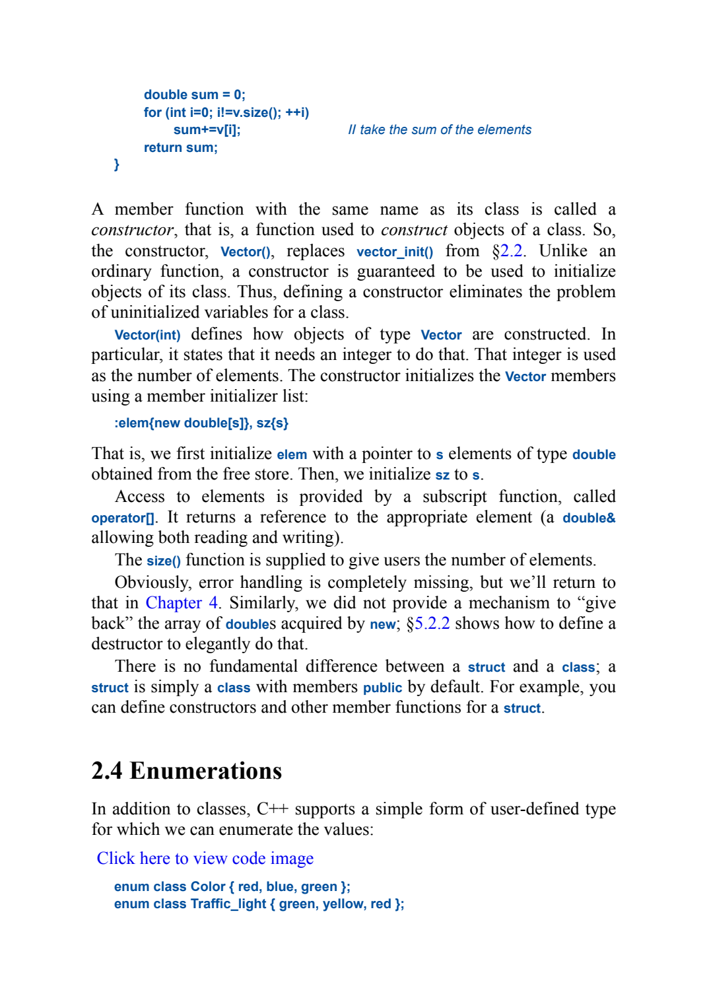
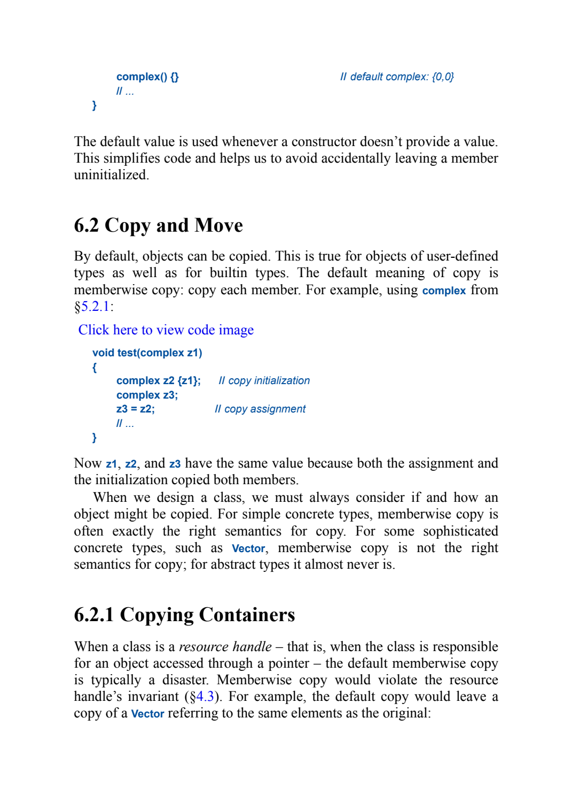
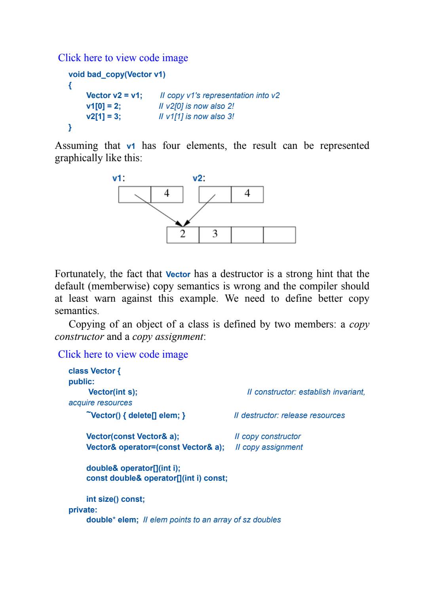
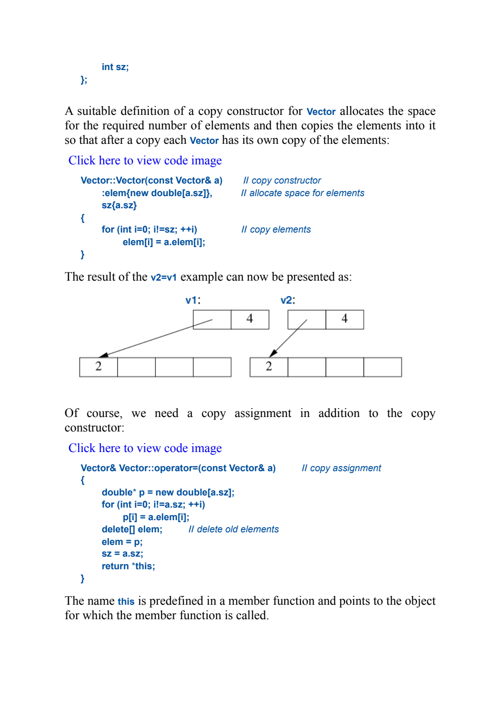
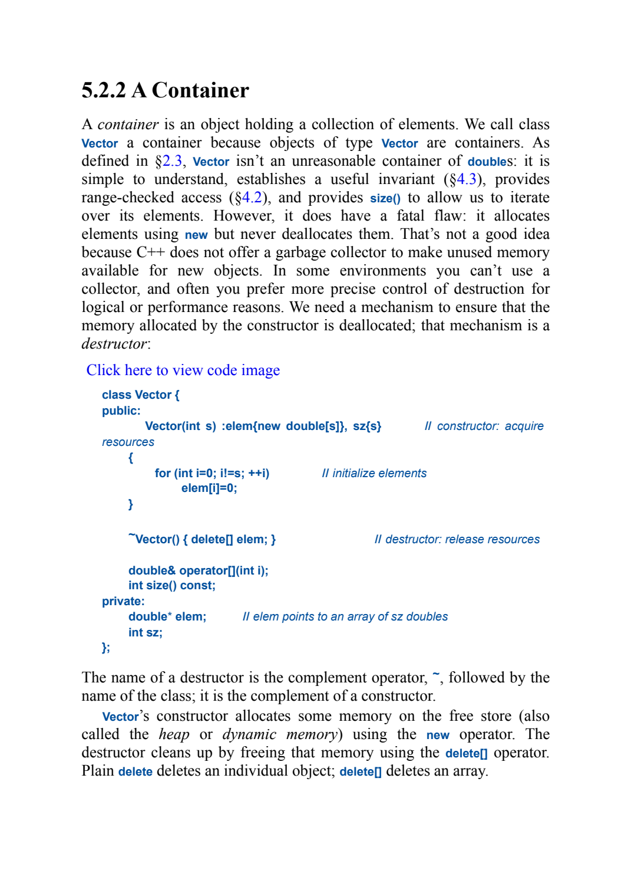
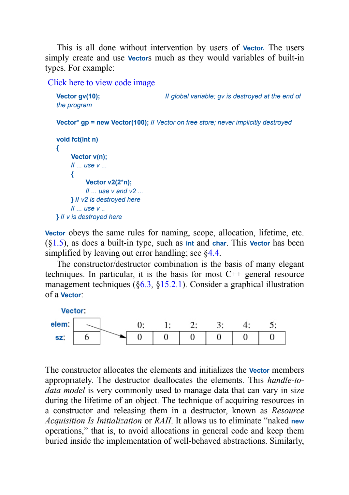
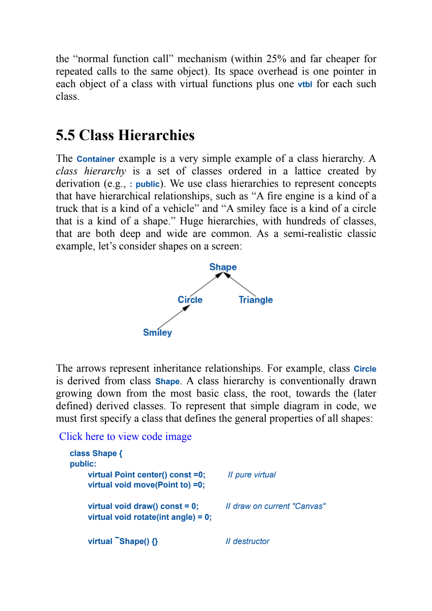
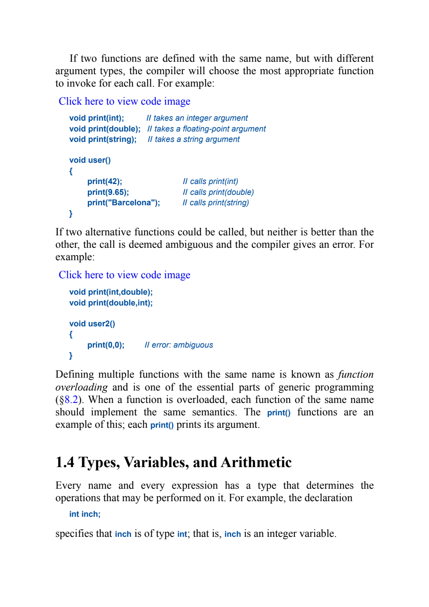

# Construction, copying, lifetime, and related OOP

[Companion lesson](../classes-and-objects/companion.md) | [PDF](../../../Projects/CppOOP/cpp-oop-notes.pdf) | [Runnable topics](../../../Projects/CppOOP/code/README.md)

The source below is **A Tour of C++, 3rd edition, by Bjarne Stroustrup**. Page locators are one-based PDF pages in the saved ebook copy; printed pagination is unverified. Definitions and the student/Teacher interpretation are lesson summaries.

## Constructors and member initialization

**Interview definition (summary):** A constructor initializes a newly created object; its initializer list initializes members before the body runs.

Section 2.3 Classes; [PDF page 50](../../A%20Tour%20of%20C%2B%2B%20-%203rd%20Edition.pdf#page=50).

The source's Vector constructor initializes `elem` and `sz` through its initializer list. Your Teacher applies the same syntax to salary, name, department, and subject. Your student uses it for name and the pointer returned by `new double(cgpa)`. The constructor establishes the starting state; it does not require class objects to have any one storage duration.

## Memberwise copying and shared addresses

**Interview definition (summary):** Memberwise copying copies each member according to that member's type; copying a raw pointer copies its address.

Sections 6.2 Copy and Move and 6.2.1 Copying Containers; [PDF page 119](../../A%20Tour%20of%20C%2B%2B%20-%203rd%20Edition.pdf#page=119).

The complex example has two numerical members, so copying the members gives a second value. The next paragraph changes the situation to a resource handle containing a pointer. That is the distinction between your Teacher's string/double members and your student's owning CGPA pointer.

Section 6.2.1 continues on [PDF page 120](../../A%20Tour%20of%20C%2B%2B%20-%203rd%20Edition.pdf#page=120).

The diagram shows two representations pointing to one element array. An update through either handle affects that shared array. Your shallow-copy program uses two borrowed pointers to one local double and prints 9.2 through both after the update. The book's Vector owns its array, so its cleanup responsibilities also matter.

## Deep copy, this, and the source object

**Interview definition (summary):** A deep copy obtains separate owned storage and copies the pointed-to values; `this` points to the destination object receiving the member operation.

Section 6.2.1; [PDF page 121](../../A%20Tour%20of%20C%2B%2B%20-%203rd%20Edition.pdf#page=121).

The constructor obtains another array and copies each element, so the diagram now has two arrays. Your constructor reduces that operation to one double: `new double(*obj.cgpaptr)`. During `student s2(s1)`, obj refers to s1 and this points to s2. A source reference avoids an extra source object; a new destination is still being constructed.

The lower half also shows copy assignment. It replaces an existing target's storage, which is a different operation from constructing a new target. The focused student lesson disables assignment, keeping its ownership behavior safe while you study the constructor.

## Destructors and block exit

**Interview definition (summary):** A destructor performs cleanup at the end of an object's lifetime; a local class object is normally destroyed as its block exits.

Section 5.2.2 A Container; [PDF page 95](../../A%20Tour%20of%20C%2B%2B%20-%203rd%20Edition.pdf#page=95).

The source pairs an array allocation with `delete[]`. Your CGPA allocation is one double, so its destructor uses `delete`. The release operation must match how the storage was obtained.

Section 5.2.2 continues on [PDF page 96](../../A%20Tour%20of%20C%2B%2B%20-%203rd%20Edition.pdf#page=96).

The inner v2 is destroyed at its block's closing brace while v remains usable. The separate destructor topic reproduces that exact lifetime pattern with s1 and an inner s2. The pointer/array diagram also shows why the handle's own storage and the dynamically allocated storage are separate concerns.

## Public inheritance

**Interview definition (summary):** Public inheritance represents an is-a relationship between a derived class and its base class.

Section 5.5 Class Hierarchies; [PDF page 104](../../A%20Tour%20of%20C%2B%2B%20-%203rd%20Edition.pdf#page=104).

The page's Shape hierarchy illustrates relationships among more general and more specific types. Your stable inheritance topic keeps the smaller person, student, gradStudent chain and explicitly initializes each base through the derived constructor's initializer list. The virtual operations in the source belong to a later runtime-polymorphism discussion.

## Function overloading

**Interview definition (summary):** Function overloading provides same-name functions with different parameter lists; argument types help the compiler select one.

Section 1.3 Functions; [PDF page 24](../../A%20Tour%20of%20C%2B%2B%20-%203rd%20Edition.pdf#page=24).

The source chooses among print functions taking int, double, and string. Your print class places the same selection idea in overloaded show member functions. The stable topic keeps only the two types you wrote: int and char. Calls with 6 and 'k' select the corresponding overloads at compile time.
