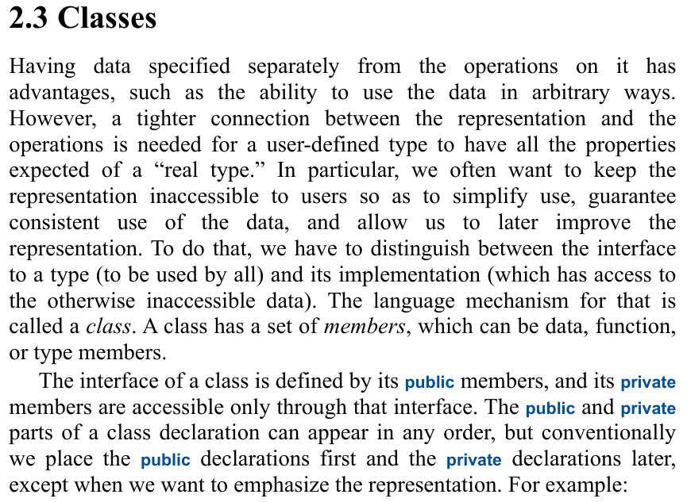

# Encapsulation in C++

**Interview definition:** Encapsulation is the bundling of data and the operations that act on it into a class, with a controlled interface that restricts direct access to implementation details.

Read the [Teacher explanation and focused snippet](../classes-and-objects/companion.md#encapsulation) in the [main companion PDF](../../../Projects/CppOOP/cpp-oop-notes.pdf). Run the separate [encapsulation program](../../../Projects/CppOOP/code/encapsulation/main.cpp) to see a rejected salary update preserve the previous value.

## Selected reading

**A Tour of C++, 3rd edition - Bjarne Stroustrup**

Section 2.3 Classes; one-based PDF page 48; printed pagination unverified.

[Original source PDF](../../A%20Tour%20of%20C%2B%2B%20-%203rd%20Edition.pdf#page=48)

This passage explains why a type separates its public interface from its implementation. That maps directly to private `salary` and public `setSalary()` and `getSalary()` in the Teacher example. The C++ Programming Language, 4th edition, section 3.2.1 ([PDF page 112](../../The%20C%2B%2B%20Programming%20Language%20-%204th%20Edition.pdf#page=112)), also discusses private representation, but adds storage and representation details beyond this first access-control example.

The definition and Teacher discussion are framed explanations, rather than verbatim book quotations. The image is a cropped excerpt from the original source page.
