# Overloading, virtual interfaces, static, friendship, and lifetime

[Companion lesson](../classes-and-objects/companion.md) | [PDF](../../../Projects/CppOOP/cpp-oop-notes.pdf) | [Topic code and run commands](../../../Projects/CppOOP/code/README.md) | [Bookshelf](../../README.md)

The actual pages below come from **A Tour of C++, 3rd edition**, and **The C++ Programming Language, 4th edition**, both by Bjarne Stroustrup. All locators are one-based PDF page numbers in the saved ebook copies; printed pagination is unverified. Definitions and the interpretations using your classes are lesson summaries.

Tour provides a compact explanation of virtual dispatch and abstract interfaces. The language reference has the clearer dedicated passages for local static variables, class static members, and friendship. The original books remain unchanged in the local bookshelf.

| Topic | Source passage | Companion PDF page |
| --- | --- | ---: |
| [Constructor overloading](#constructor-overloading) | Language reference, 16.2.5, PDF 624-625 | 14 |
| [Operator overloading](#operator-overloading) | Tour, 6.4, PDF 126-127 | 15 |
| [Abstract classes and overriding](#abstract-classes-and-overriding) | Tour, 5.3, PDF 99-100 | 16, 18 |
| [Virtual functions](#virtual-functions) | Tour, 5.4, PDF 103 | 17 |
| [Local static variables](#local-static-variables) | Language reference, 12.1.8, PDF 443-444 | 19 |
| [Static class members](#static-class-members) | Language reference, 16.2.12, PDF 638-639 | 20 |
| [Friend functions](#friend-functions) | Language reference, 19.4, PDF 772-773 | 21 |
| [Friend classes](#friend-classes) | Language reference, 19.4, PDF 774 | 22 |
| [Object lifetime](#object-lifetime) | Tour, 1.5, PDF 30 | 23 |

## Constructor overloading

**Interview definition (summary):** Constructor overloading provides constructors with different parameter lists so the compiler can select a suitable way to initialize an object from its arguments.

The C++ Programming Language, 4th edition, section 16.2.5 Constructors; [PDF pages 624-625](../../The%20C%2B%2B%20Programming%20Language%20-%204th%20Edition.pdf#page=624).

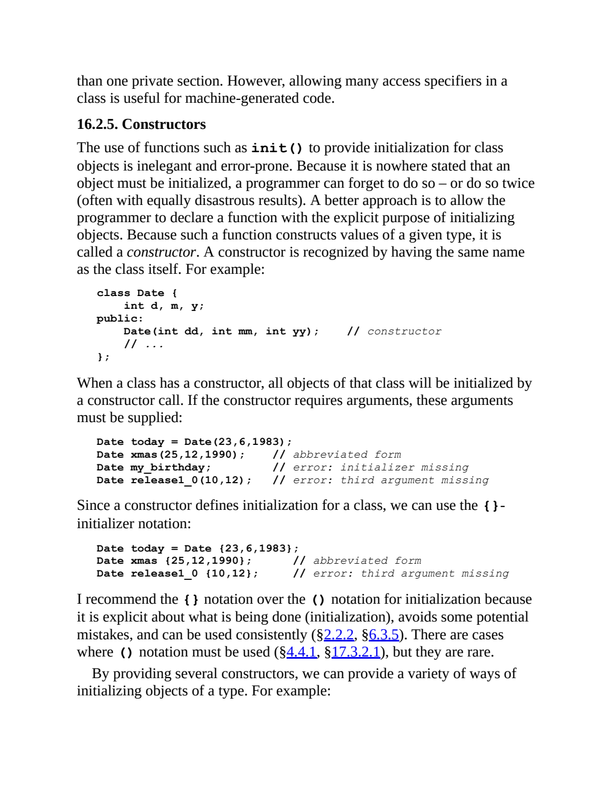

The Date declaration gives initialization an explicit home: its constructor. The examples show that arguments required by a constructor must be supplied. Your student class uses the same rule, with a default constructor for an unspecified name and a parameterized constructor for a supplied name. Both initialize a new object before it is used.

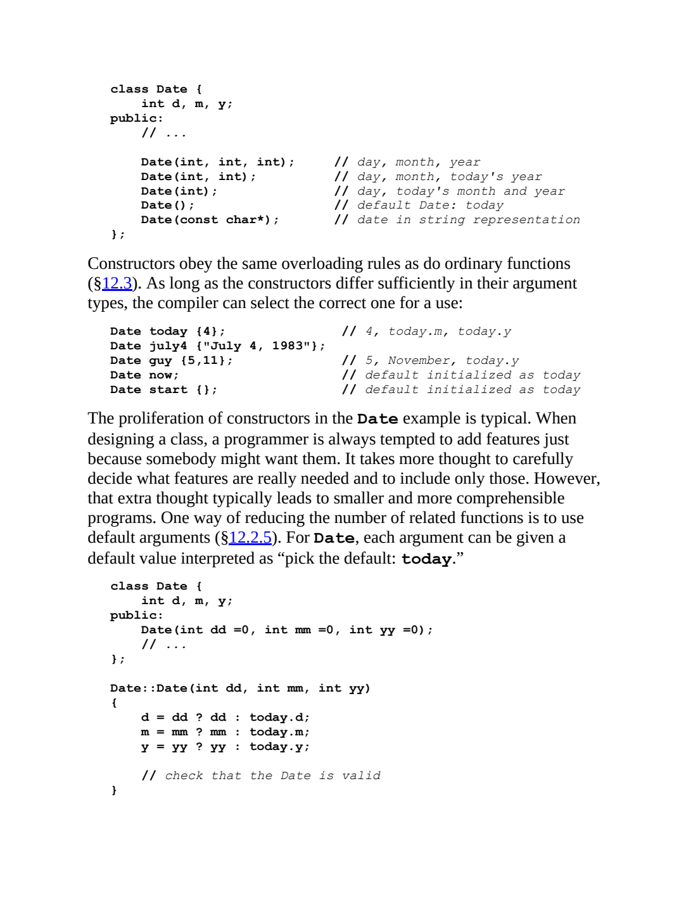

The overloads differ by their arguments, and the uses below them select the applicable overload. Your version keeps only two choices: `student s1;` and `student s2("Kapil");`. The selection happens at compilation; assigning `s1.name` later changes an existing object. The book's discussion of avoiding excessive constructors is useful here: the two choices already cover your current exercise.

## Operator overloading

**Interview definition (summary):** Operator overloading defines how an existing C++ operator works with a user-defined type.

A Tour of C++, 3rd edition, section 6.4 Operator Overloading; [PDF pages 126-127](../../A%20Tour%20of%20C%2B%2B%20-%203rd%20Edition.pdf#page=126).

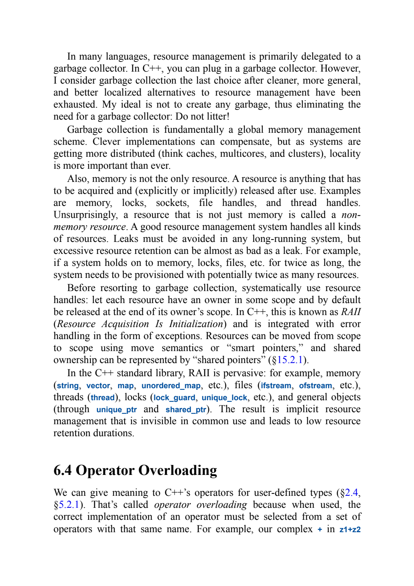

The final section introduces choosing an operator implementation for a user-defined type. Your Score addition follows that idea: `first + second` selects `Score::operator+`, while the addition of their integer points inside that function remains built-in integer addition. The result is a new Score; the two operands retain 20 and 30.

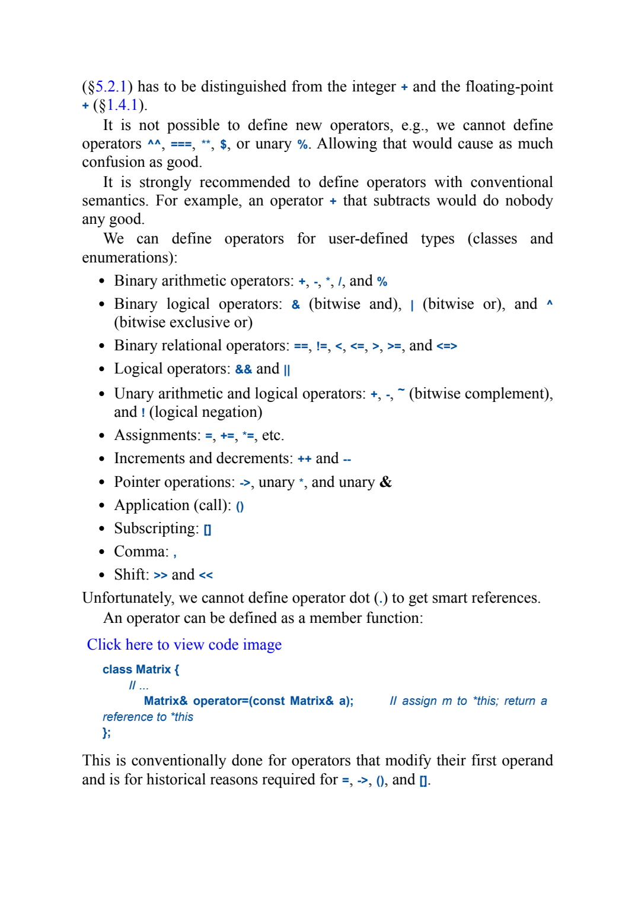

The page distinguishes existing operators from invented symbols and recommends meanings readers expect. This is why the lesson uses ordinary point addition rather than changing + into an unrelated operation. The older discussion of which operators must be members has standard-version details beyond this exercise; the lesson uses a conventional non-static member + supported by the configured C++20 compiler.

## Abstract classes and overriding

**Interview definition (summary):** An abstract class cannot be instantiated because at least one virtual operation remains pure virtual. Overriding provides a derived implementation of a virtual base function.

A Tour of C++, 3rd edition, section 5.3 Abstract Types; [PDF pages 99-100](../../A%20Tour%20of%20C%2B%2B%20-%203rd%20Edition.pdf#page=99).

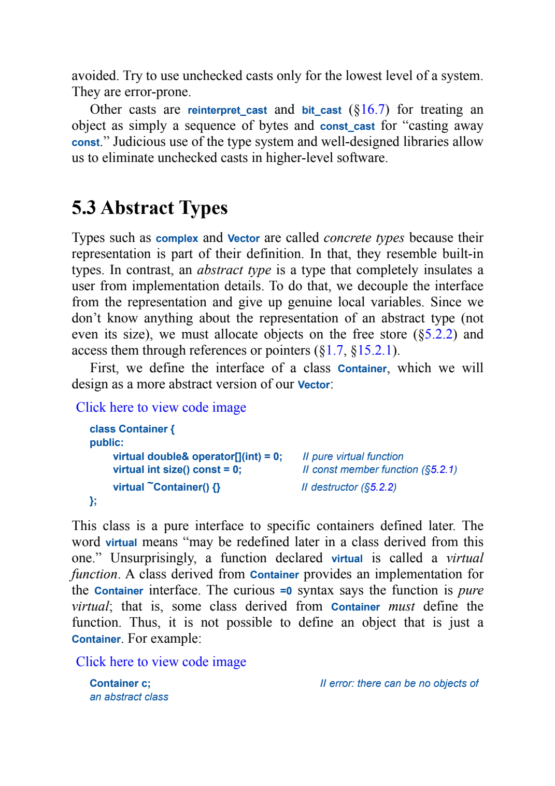

Container declares the operations its users can call, while its implementations are supplied by derived classes. The `= 0` declarations make the interface abstract. Your shape reduces that contract to one operation, draw. `shape s1;` is rejected, while a circle that supplies draw can be constructed. Abstract classes may also have data and constructors; this pure-interface example simply does not need them.

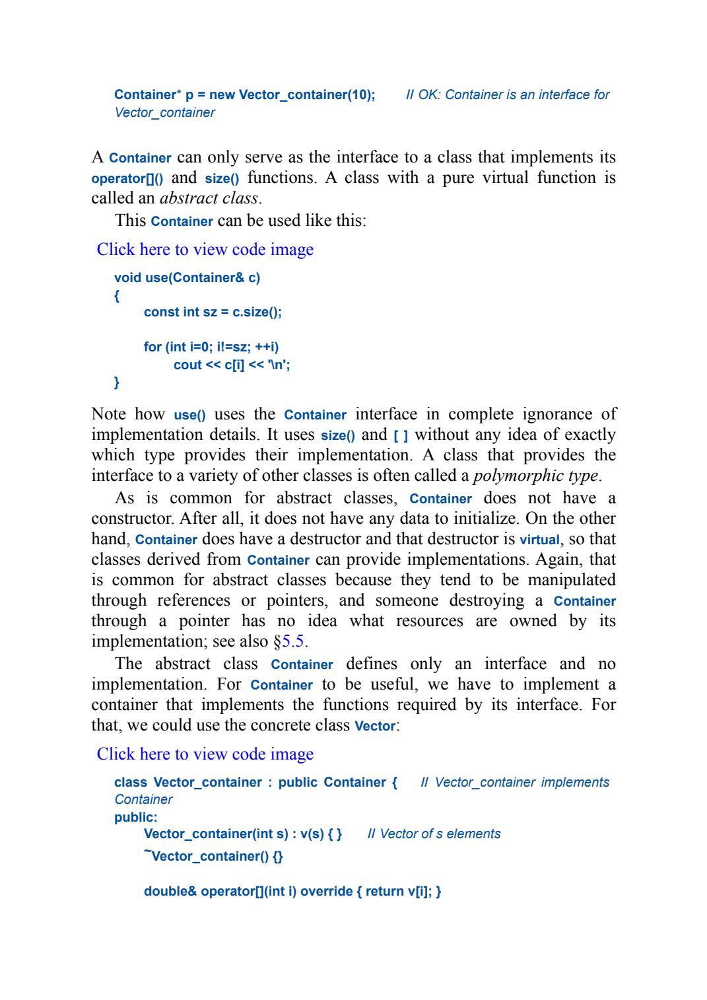

The use function receives a Container reference and calls its interface without knowing the concrete container's representation. Your showShape similarly accepts `const shape&`. The override declarations in Vector_container show the compiler-checking syntax used in your child and circle examples. The actual circle may be a local object; an abstract interface does not inherently require dynamic allocation. This is an added clarification to the book's discussion of separating interface and representation.

## Virtual functions

**Interview definition (summary):** Runtime polymorphism lets a virtual call through a base interface select the implementation belonging to the actual derived object.

A Tour of C++, 3rd edition, section 5.4 Virtual Functions; [PDF page 103](../../A%20Tour%20of%20C%2B%2B%20-%203rd%20Edition.pdf#page=103).

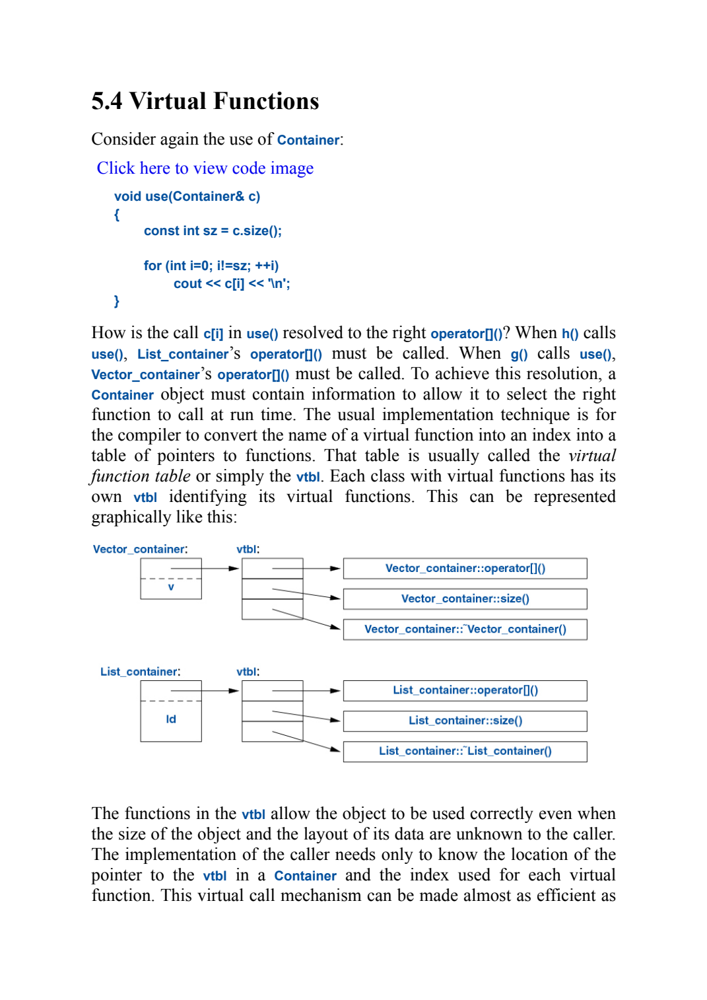

The same use function can receive different container implementations. Its virtual operation therefore reaches either Vector_container or List_container. Your parent pointer to c1 supplies the smaller equivalent: `p1->hello()` reaches child's override, while the non-virtual `p1->getinfo()` calls parent's function. Neither operation constructs a new object.

The two table diagrams depict a typical implementation of that selection. They explain why the call can preserve behavior while the caller uses only the base interface. C++ requires the dispatch behavior, rather than this exact table layout. Matching declarations and `override` keep the interface relationship checked by the compiler; calling an unrelated same-name non-virtual function is name hiding.

## Local static variables

**Interview definition (summary):** A local static variable retains its state between calls while its name remains local to its block.

The C++ Programming Language, 4th edition, section 12.1.8 Local Variables; [PDF pages 443-444](../../The%20C%2B%2B%20Programming%20Language%20-%204th%20Edition.pdf#page=443).

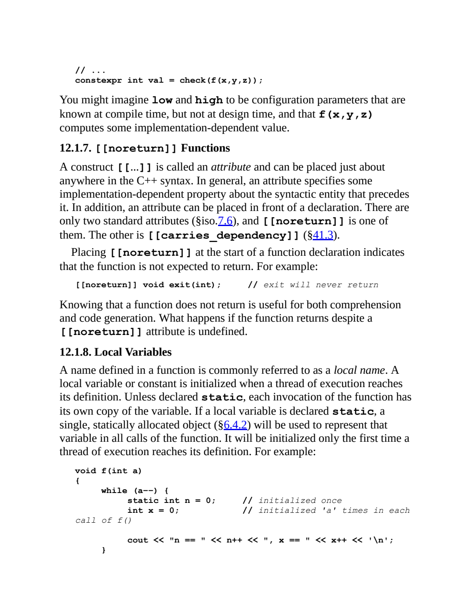

The loop's static n and automatic x receive different storage-duration rules. Your trackVisits removes the loop and makes three separate function calls: visits reaches 1, 2, and 3, while localVisits is recreated and reaches 1 every time. Initialization supplies a starting value; increments still happen whenever execution reaches them.

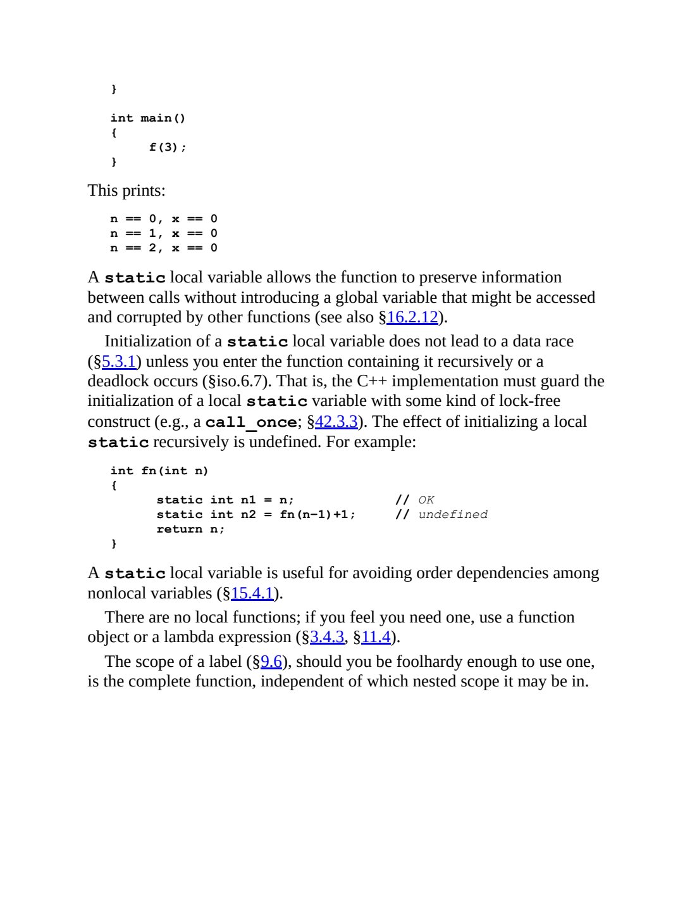

The output shows that state survives while the function keeps a local name. The discussion of guarded initialization concerns initialization, not making every later read or increment safe for concurrent calls. Your example is a single-threaded trace. A zero-initialized int can be initialized statically; when dynamic initialization is required, it occurs on the first successful execution of the declaration. These are clarifications of the concise first-use description.

## Static class members

**Interview definition (summary):** A static data member is shared by the class's objects. A static member function has no implicit current object or this pointer.

The C++ Programming Language, 4th edition, section 16.2.12 Static Members; [PDF pages 638-639](../../The%20C%2B%2B%20Programming%20Language%20-%204th%20Edition.pdf#page=638).

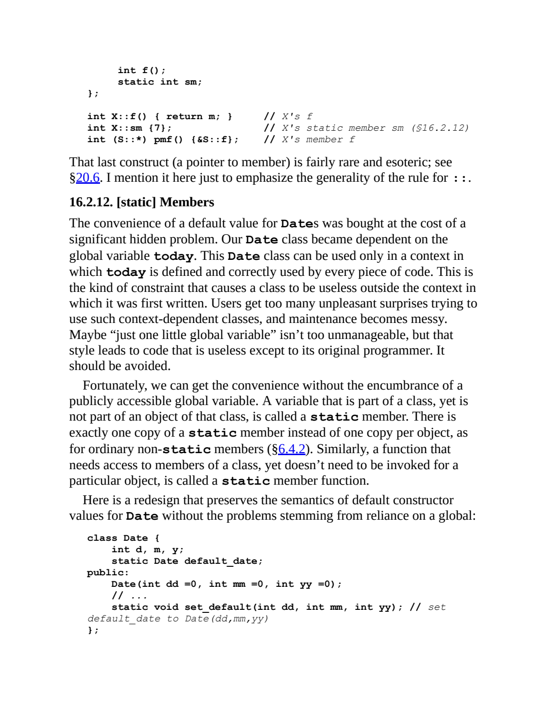

The Date example moves shared state into the class instead of giving every Date object its own copy. Your student keeps a name per object and one shared totalCreated counter. Creating s1 and s2 invokes the named constructor twice and updates that one counter to 2. Its static getter can be called before either student exists because it needs no current student.

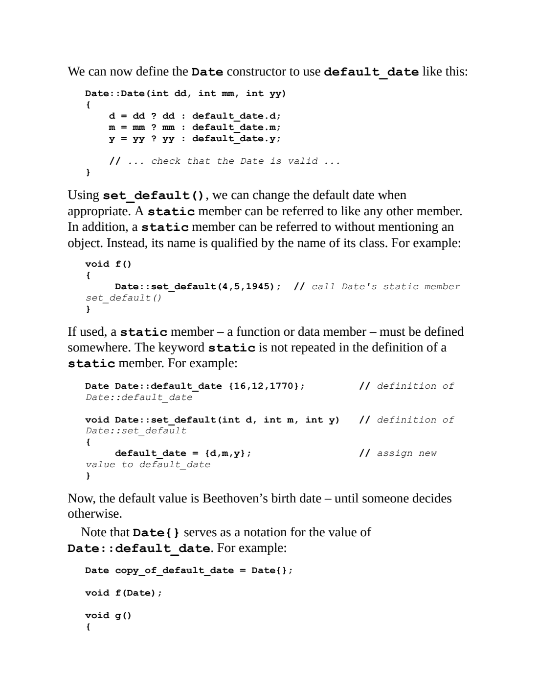

The Date-qualified call and definition demonstrate `ClassName::member`. Your `int student::totalCreated = 0;` defines the shared counter outside the class, and `student::getTotalCreated()` invokes its getter. The getter can read private static data as a member of student; using an individual name would require an explicitly supplied student object. Static member functions may run repeatedly.

## Friend functions

**Interview definition (summary):** A friend function is granted access to a class's private and protected members. A non-member friend remains a non-member function.

The C++ Programming Language, 4th edition, section 19.4 Friends; [PDF pages 772-773](../../The%20C%2B%2B%20Programming%20Language%20-%204th%20Edition.pdf#page=772).

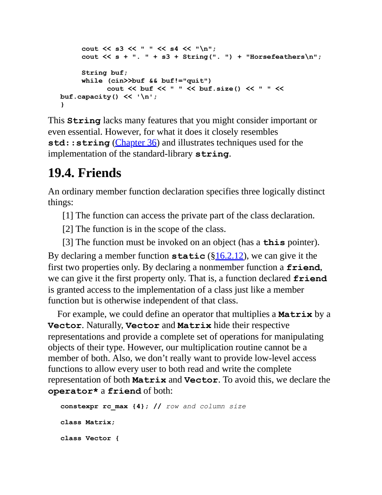

The three listed member-function properties separate private access, class scope, and an implicit object. A non-member friend receives the private-access privilege without becoming a member or receiving a this pointer. Your showSalary receives t1 explicitly as a const reference and reads its private salary because Teacher names that function as a friend.

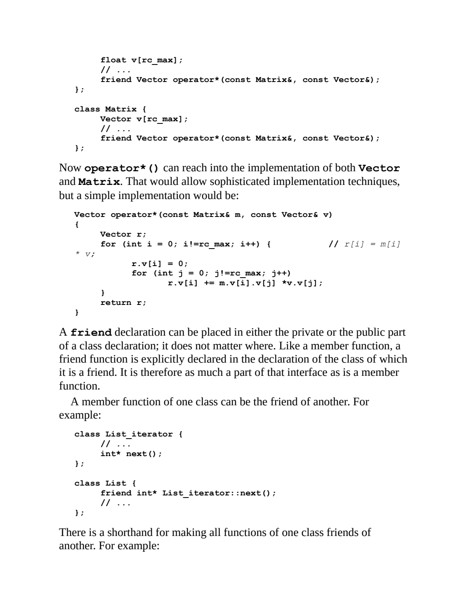

The Matrix/Vector operation illustrates why one function can need the representations of two collaborating types. Your smaller salary function needs only Teacher's representation. The friend declaration can appear under public or private access without changing its effect. The ordinary call is `showSalary(t1)`, while unrelated functions still cannot read salary directly.

## Friend classes

**Interview definition (summary):** A friend class's member functions are granted access to the private and protected members of the class declaring the friendship.

The C++ Programming Language, 4th edition, section 19.4 Friends; [PDF page 774](../../The%20C%2B%2B%20Programming%20Language%20-%204th%20Edition.pdf#page=774).

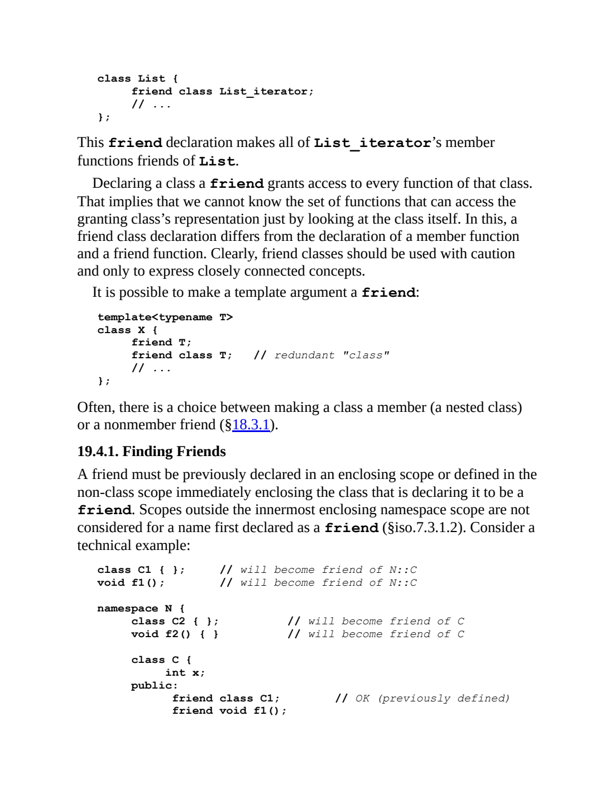

The List declaration grants List_iterator's member functions access to List's representation. Your Teacher declaration does the same for Payroll. Payroll::printSalary reads the explicitly supplied Teacher object's salary; its own this pointer still refers to Payroll.

The passage explains that a class-wide grant covers more operations than naming one function. That is why the companion keeps friend functions and friend classes separate. Friendship is access authorization, rather than inheritance or object containment. It is directional and does not automatically become reciprocal, transitive, or inherited.

## Object lifetime

**Interview definition (summary):** Object lifetime describes when an object exists; storage duration describes how long its storage persists. Scope describes where a name can be used.

A Tour of C++, 3rd edition, section 1.5 Scope and Lifetime; [PDF page 30](../../A%20Tour%20of%20C%2B%2B%20-%203rd%20Edition.pdf#page=30).

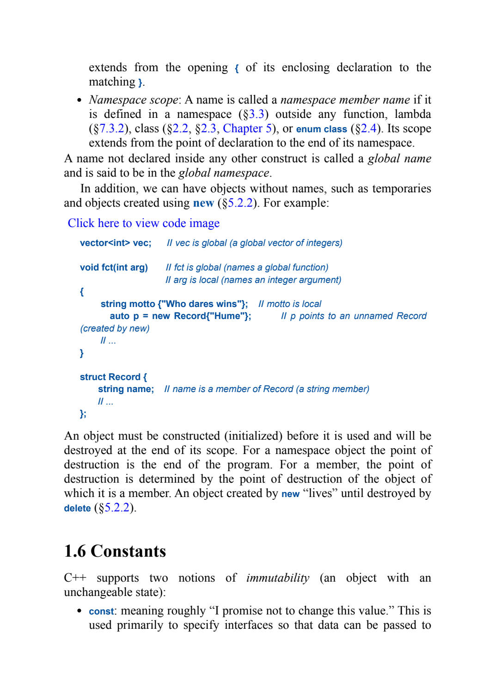

The examples place names in different scopes and separately show an unnamed object created with new. For your automatic students, s2's destructor runs at the inner block's exit, visitor's runs as visit returns, and s1's runs as main returns. The surviving s1 can still be used after the inner block ends.

The dynamically allocated Record makes the distinction clearer: returning from the function does not itself delete the separately allocated object. The local pointer and the pointed-to object's storage have different durations. Your earlier CGPA-owning destructor handles that responsibility explicitly, while the local static counter demonstrates persistent state with a block-local name. Precise class-lifetime boundaries are given in the companion with the working draft reference.
