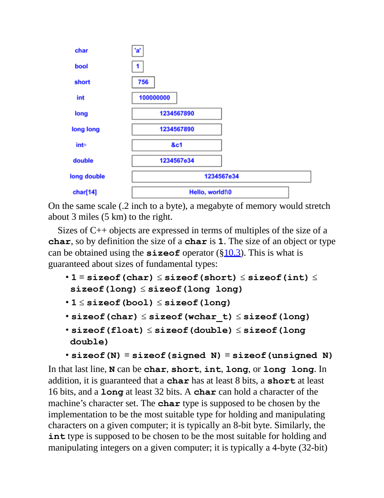
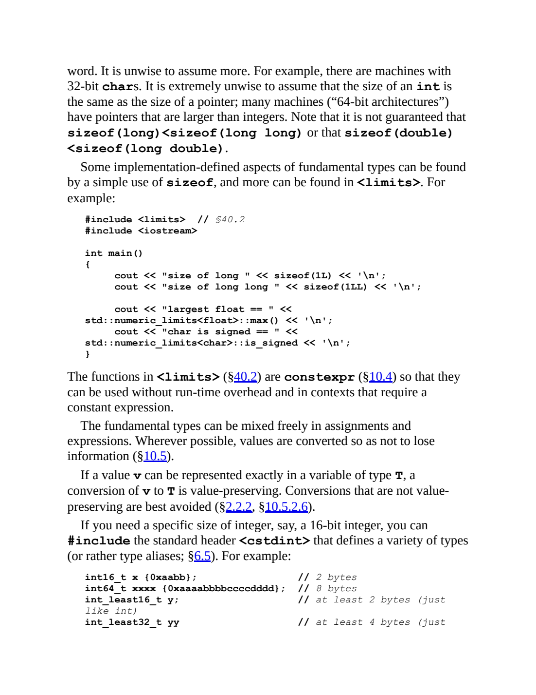

# C++ type sizes

[Companion lesson](../classes-and-objects/companion.md#storage-size-bytes-and-bits) | [PDF](../../../Projects/CppOOP/cpp-oop-notes.pdf) | [Runnable measurements](../../../Projects/CppOOP/code/type_sizes/main.cpp)

## Bytes, bits, and size relationships

**Interview definition (summary):** The size of a type is the storage occupied by its object, measured in C++ bytes using `sizeof`.

**The C++ Programming Language, 4th edition - Bjarne Stroustrup.** Section 6.2.8 Sizes; one-based PDF page 229. Printed pagination is unverified for this ebook copy.

[Original PDF page](../../The%20C%2B%2B%20Programming%20Language%20-%204th%20Edition.pdf#page=229)

The diagram compares the storage used by several types on one plausible machine. The boxes are an illustration of that layout, rather than a table of every compiler's sizes. The paragraph beneath it defines the unit: a `char` occupies one C++ byte, and `sizeof` reports multiples of that unit.

The integer relationship uses less-than-or-equal signs. Equal sizes are allowed: the installed Microsoft x64 compiler gives both `int` and `long` 4 bytes. Its `double` and `long double` are both 8 bytes. `CHAR_BIT` is 8 here, so 4 bytes correspond to 32 storage bits. The document's minimum integer widths are expressed separately in bits.

I selected this passage because it shows the size relationships directly. Tour's shorter [section 1.4, PDF page 25](../../A%20Tour%20of%20C%2B%2B%20-%203rd%20Edition.pdf#page=25) is a clear introduction to type, value, object, and variable; this section adds the comparisons needed for the larger type list.

## Measuring size, range, and precision

**Interview definition (summary):** Size measures storage, range describes representable values, and precision describes how much numerical detail a type can preserve.

**The C++ Programming Language, 4th edition - Bjarne Stroustrup.** Section 6.2.8 continues on one-based PDF page 230. Printed pagination is unverified.

[Original PDF page](../../The%20C%2B%2B%20Programming%20Language%20-%204th%20Edition.pdf#page=230)

This page gives the practical measurement tools. `sizeof(1L)` measures a long literal's type; `sizeof(1LL)` measures a long long literal's type. The `<limits>` queries answer different questions: the largest finite floating-point value and whether plain char is signed. The selected [type-size program](../../../Projects/CppOOP/code/type_sizes/main.cpp) expands those same ideas to every type in your question.

For your pointer lesson, measure `sizeof(cgpaptr)` and `sizeof(*cgpaptr)` separately. The first is the address-holding pointer object; the second is the double type. Their values happen to be 8 bytes each on this compiler. The pointer's size does not include the pointee's allocation.

The page also introduces `<cstdint>` names when an exact width is needed. A simple current example is `std::int32_t count = 33;` when that type is available. The 32 denotes bits, not bytes. Refer to the companion's [integer table](../classes-and-objects/companion.md#integer-types-and-their-sizes) and [floating-point explanation](../classes-and-objects/companion.md#bool-characters-and-floating-point) for the verified local sizes and precision.

The source pages are from a C++11-era reference. The companion's byte rules and minimum-width table were checked against primary language references; its compiler-specific numbers were measured locally. These definitions and explanations are summaries, not quotations.
